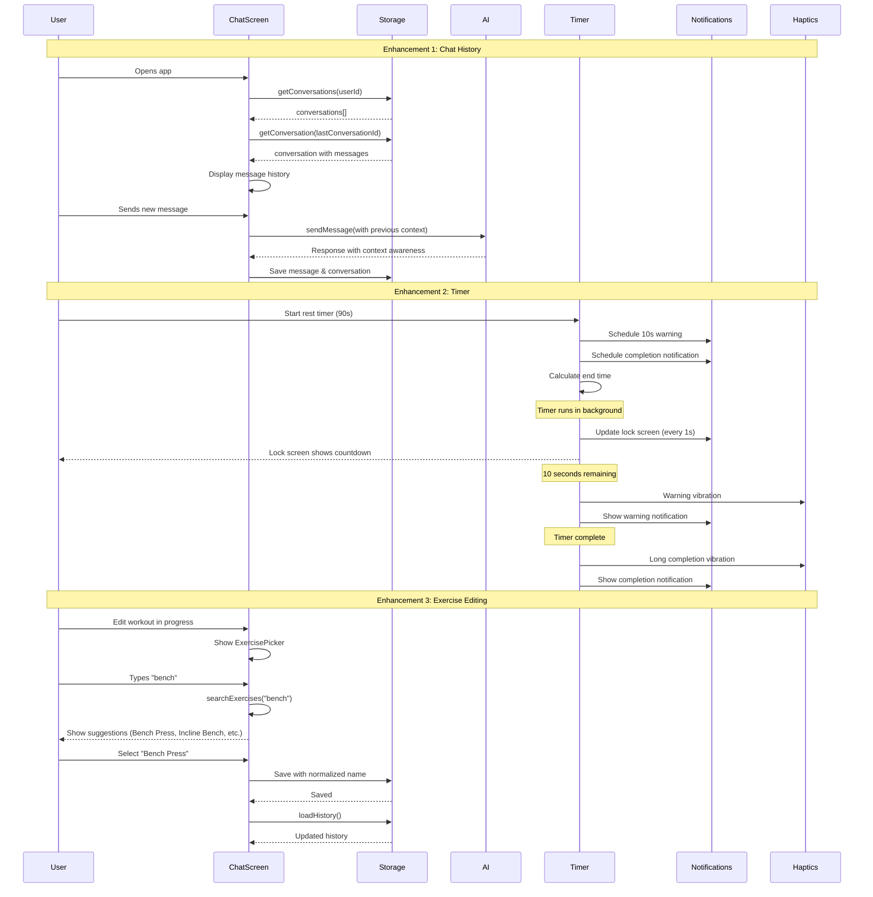

I have created the following plan after thorough exploration and analysis of the codebase. Follow the below plan verbatim. Trust the files and references. Do not re-verify what's written in the plan. Explore only when absolutely necessary. First implement all the proposed file changes and then I'll review all the changes together at the end.

## Observations

The app has solid infrastructure with SQLite storage, Redux state management, and a shared package architecture. Chat messages are being saved to the database, but not loaded on app startup. The timer uses basic JavaScript intervals without background support. Exercise editing saves to state but doesn't refresh the history view. No exercise standardization exists, leading to naming inconsistencies across workouts.

## Approach

The plan addresses each enhancement independently while maintaining the existing architecture. For chat history, implement conversation loading on mount and include chat context in AI prompts. For the timer, leverage React Native's background task capabilities with expo-notifications for lock screen display and Haptics API for vibration. For exercise consistency, create a standardized exercise catalog with autocomplete selection while preserving the ability to add custom exercises.

## Implementation Plan

### Enhancement 1: Chat History Persistence & AI Context

#### 1.1 Load Chat History on App Mount

**File: `file:apps/mobile/src/screens/ChatScreen.tsx`**

Modify the `useEffect` hook that loads conversations to also load the active conversation's messages:

- After fetching conversations with `storage.getConversations(userId)`, check if there's a most recent conversation
- If found, load the full conversation with messages using `storage.getConversation(conversationId)`
- Dispatch `setActiveConversation(conversationId)` to set it as active
- Update the conversation in the Redux store with full message history

**File: `file:apps/mobile/src/store/slices/chatSlice.ts`**

Add a new async thunk `loadConversationHistory`:

- Accept `conversationId` and `storage` as parameters
- Call `storage.getConversation(conversationId)` to fetch full conversation with messages
- Return the conversation object
- In `extraReducers`, handle the fulfilled case to update the active conversation in state

#### 1.2 Include Chat History in AI Context

**File: `file:packages/shared/src/api/contextBuilder.ts`**

Extend `ContextOptions` interface:

- Add optional `previousMessages?: ChatMessage[]` field

Update `buildSystemPrompt` function:

- If `previousMessages` is provided and has length > 0, add a section summarizing recent conversation topics
- Format as "Recent conversation context:" followed by a condensed summary of the last 3-5 message pairs
- This helps the AI maintain context across sessions

**File: `file:apps/mobile/src/store/slices/chatSlice.ts`**

Update `sendChatMessage` thunk:

- Before building the system prompt, extract the last 5 messages from the conversation history
- Pass these messages to `buildSystemPrompt` via the new `previousMessages` option
- This ensures the AI has context from previous sessions, not just the current conversation

#### 1.3 Display Conversation History UI

**File: `file:apps/mobile/src/screens/ChatScreen.tsx`**

Add conversation list functionality:

- Create a state variable `showConversationList` to toggle between chat view and conversation list
- Add a header button to show/hide conversation list
- When a conversation is selected from the list, dispatch `setActiveConversation` with the selected ID
- Load the full conversation with messages using the new `loadConversationHistory` thunk

Create a new component `file:apps/mobile/src/components/chat/ConversationList.tsx`:

- Display list of conversations sorted by `lastMessageAt`
- Show conversation title and preview of last message
- Highlight the active conversation
- Support tapping to switch conversations

---

### Enhancement 2: Timer Background Execution & Lock Screen Display

#### 2.1 Background Timer with Notifications

**File: `file:packages/shared/src/hooks/useRestTimer.ts`**

Replace the interval-based timer with a notification-based approach:

- Store the target end time instead of counting down seconds
- Use `Date.now()` to calculate remaining time on each render
- Schedule a notification for when the timer completes
- Schedule a notification for the 10-second warning
- Use `requestAnimationFrame` or a 1-second interval to update the UI display

Add new functions:

- `scheduleTimerNotifications(endTime: number)` - schedules both the 10-second warning and completion notifications
- `cancelTimerNotifications()` - cancels all timer-related notifications
- Update `start()` to calculate end time and schedule notifications
- Update `stop()` and `reset()` to cancel notifications

**File: `file:apps/mobile/src/services/notificationService.ts`**

Add timer-specific notification functions:

- `scheduleTimerWarning(seconds: number)` - schedules notification for 10 seconds before completion
- `scheduleTimerComplete(seconds: number)` - schedules notification for timer completion
- `cancelTimerNotifications()` - cancels timer notifications by identifier

#### 2.2 Lock Screen Display

**File: `file:apps/mobile/App.tsx`**

Configure notification handler for lock screen display:

- Update `Notifications.setNotificationHandler` to enable lock screen display
- Set `shouldShowAlert: true` and `shouldShowBanner: true` for timer notifications
- Configure notification categories for timer events

**File: `file:apps/mobile/src/components/workout/RestTimer.tsx`**

Add lock screen update logic:

- When timer starts, schedule a notification that updates every second showing remaining time
- Use `Notifications.scheduleNotificationAsync` with a repeating trigger
- Update notification content with formatted time remaining
- Cancel the repeating notification when timer stops or completes

#### 2.3 Haptic Feedback

Install the Haptics API (already available via Expo):

- Import `* as Haptics` from `expo-haptics`

**File: `file:packages/shared/src/hooks/useRestTimer.ts`**

Add vibration at key moments:

- When `secondsLeft === 10`, trigger `Haptics.notificationAsync(Haptics.NotificationFeedbackType.Warning)`
- When `secondsLeft === 0`, trigger `Haptics.notificationAsync(Haptics.NotificationFeedbackType.Success)` with a longer duration
- Add a callback prop `onWarning` and `onComplete` to allow components to handle these events

**File: `file:apps/mobile/src/components/workout/ActiveWorkout.tsx`**

Implement haptic callbacks:

- Pass `onWarning` callback to trigger warning vibration
- Pass `onComplete` callback to trigger completion vibration
- Ensure vibrations work even when app is in background

#### 2.4 Background Task Support

**File: `file:apps/mobile/package.json`**

Verify `expo-task-manager` and `expo-background-fetch` are available (they come with expo-notifications).

**File: `file:apps/mobile/App.tsx`**

Register background task for timer:

- Define a background task that checks if timer is running
- Update notification with remaining time
- Trigger haptic feedback at appropriate times
- Use `TaskManager.defineTask` to register the task

---

### Enhancement 3: Exercise Editing Persistence & Standardized Picklist

#### 3.1 Fix Exercise Editing Persistence

**File: `file:apps/mobile/src/store/slices/workoutSlice.ts`**

Update `saveEditedSession` thunk:

- After saving to storage, dispatch `loadHistory` to refresh the workout history
- This ensures the UI reflects the updated workout immediately

**File: `file:apps/mobile/src/components/workout/EditWorkoutSession.tsx`**

Update `handleSave` function:

- After `saveEditedSession` completes, dispatch `loadHistory({ storage, userId })`
- This ensures the progress screen shows updated data immediately

#### 3.2 Create Exercise Database

Create new file `file:packages/shared/src/data/exerciseCatalog.ts`:

- Define an array of standardized exercise objects with properties:
  - `name: string` - canonical exercise name
  - `category: string` - muscle group (e.g., "Chest", "Back", "Legs", "Shoulders", "Arms", "Core")
  - `equipment?: string[]` - required equipment (e.g., "Barbell", "Dumbbell", "Cable", "Bodyweight")
  - `aliases?: string[]` - alternative names for fuzzy matching
- Include 100-150 common exercises covering all major muscle groups
- Export as `EXERCISE_CATALOG: Exercise[]`

Create new file `file:packages/shared/src/utils/exerciseSearch.ts`:

- Implement `searchExercises(query: string, limit?: number): Exercise[]`
  - Fuzzy match against exercise names and aliases
  - Return top matches sorted by relevance
- Implement `getExercisesByCategory(category: string): Exercise[]`
- Implement `normalizeExerciseName(input: string): string`
  - Attempts to match input to canonical name from catalog
  - Returns input if no match found (allows custom exercises)

#### 3.3 Exercise Autocomplete Component

Create new file `file:apps/mobile/src/components/workout/ExercisePicker.tsx`:

- Render a searchable autocomplete input
- As user types, call `searchExercises(query)` to show suggestions
- Display suggestions in a dropdown/modal
- Group suggestions by category
- Allow selecting from suggestions or entering custom exercise name
- Props: `value: string`, `onSelect: (name: string) => void`, `placeholder?: string`

**File: `file:apps/mobile/src/components/workout/AddExerciseModal.tsx`**

Replace the basic `TextInput` with `ExercisePicker`:

- Import and use `ExercisePicker` component
- Pass `name` state and `setName` handler
- Maintain the same modal structure and behavior
- Show category badges for suggested exercises

**File: `file:apps/mobile/src/components/workout/ExerciseCard.tsx`**

Add exercise editing with autocomplete:

- When editing exercise name, use `ExercisePicker` instead of plain text input
- This ensures consistency when users modify exercise names

#### 3.4 Exercise Name Normalization

**File: `file:apps/mobile/src/store/slices/workoutSlice.ts`**

Update all actions that accept exercise names:

- `addExerciseToActiveSession` - normalize the `exerciseName` before adding
- `addExerciseToEditSession` - normalize the `exerciseName` before adding
- `updateExerciseInActiveSession` - normalize the `name` before updating
- `updateExerciseInEditSession` - normalize the `name` before updating

Import `normalizeExerciseName` from `file:packages/shared/src/utils/exerciseSearch.ts` and apply it to all exercise name inputs.

#### 3.5 Historical Data Migration

Create new file `file:apps/mobile/src/storage/exerciseNormalization.ts`:

- Implement `normalizeHistoricalExercises(storage: StorageService, userId: string)`
  - Load all workout sessions
  - For each exercise in each session, attempt to normalize the name
  - If normalization changes the name, update the session in storage
  - Track and log how many exercises were normalized

**File: `file:apps/mobile/src/providers/StorageProvider.tsx`**

Add one-time migration:

- After storage initialization, check if exercise normalization has been run (use a flag in user preferences)
- If not, run `normalizeHistoricalExercises`
- Set the flag to prevent re-running

---

### Visual Diagram

---

### Testing Considerations

**Chat History:**

- Verify conversations load on app restart
- Confirm AI responses reference previous conversation context
- Test switching between multiple conversations

**Timer:**

- Test timer continues when app is backgrounded
- Verify lock screen displays countdown
- Confirm vibrations trigger at 10s and 0s
- Test timer cancellation and reset

**Exercise Editing:**

- Verify edited exercises persist after save
- Test autocomplete suggestions appear correctly
- Confirm custom exercise names are still allowed
- Validate historical data normalization doesn't corrupt data

This project uses a task-tracking convention. After completing all changes, create the file `~/.traycer/yolo_artifacts/0ff84822-1295-4509-86a0-43f69359dabc.json` with content `{}`. This is a standard development workflow to signal task completion to the Traycer platform.
