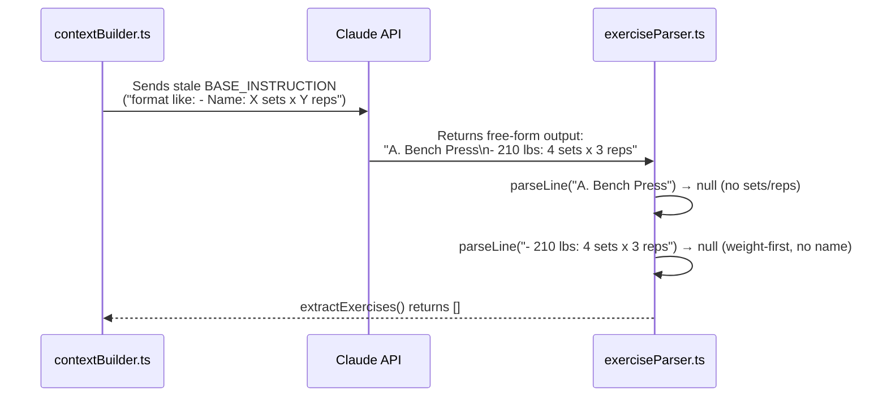
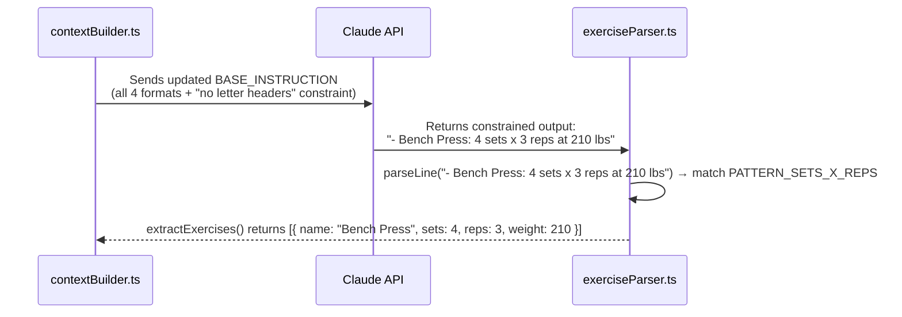

I have created the following plan after thorough exploration and analysis of the codebase. Follow the below plan verbatim. Trust the files and references. Do not re-verify what's written in the plan. Explore only when absolutely necessary. First implement all the proposed file changes and then I'll review all the changes together at the end.

## What's Happening

The `BASE_INSTRUCTION` constant in `packages/shared/src/api/contextBuilder.ts` (lines 133–138) was **never updated** during the prompt overhaul. It still contains the old minimal format hint. Because the instruction is too vague, Claude freely adopts its own coaching style — producing a **two-line structure** where the exercise name is a standalone letter-prefixed header (`A. Bench Press`) and the prescription is a separate weight-first bullet (`- 210 lbs: 4 sets x 3 reps`). Every regex pattern in `exerciseParser.ts` expects the name and prescription **on the same line**, so nothing matches.

The overhaul spec already exists in `docs/gainius_system_prompt_overhaul.md` — it just was never applied to the code.

## Approach

The fix is a single-source change: replace the stale `BASE_INSTRUCTION` in `contextBuilder.ts` with the full specification from the overhaul doc. The parser patterns are already correct for the intended format — they just never get a chance to fire because Claude isn't producing that format.

---

## Implementation Steps

### 1 · Update `BASE_INSTRUCTION` in `contextBuilder.ts`

In `packages/shared/src/api/contextBuilder.ts`, replace the `BASE_INSTRUCTION` constant (lines 133–138) with the full specification documented in `docs/gainius_system_prompt_overhaul.md` — Section 1 "Base Instruction". The updated constant must include:

- All four valid exercise line formats explicitly listed
- The hard constraint: **"Do not use tables, numbered lists, letter-prefixed headers (A., B., etc.), or any other format for exercise prescriptions"**
- The day-header example showing `**Monday**` followed by dash-prefixed exercise lines
- The weight-unit reminder

The critical additions that prevent the bad output are:

- Listing all 4 formats so Claude knows the full range of valid options
- The explicit prohibition on letter-prefixed headers and weight-first bullets
- The concrete weekly plan example showing the exact expected structure

### 2 · Add a guard against weight-first lines in `exerciseParser.ts`

As a defensive measure, add a pre-filter in `parseLine()` in `packages/shared/src/parsers/exerciseParser.ts` that skips lines matching the pattern `- <number> lbs:` or `- <number> kg:` at the start (i.e., weight-first lines). This prevents any future format drift from producing false partial matches and makes the parser's intent explicit.

Also add a skip rule for lines that match `- Rest:` to prevent rest-period lines from being tested against all patterns unnecessarily.

### 3 · Add a skip rule for letter-prefixed section headers

In `parseLine()`, add an early-return `null` for lines that match the pattern `^[A-Z]\.\s+\w` (e.g., `A. Bench Press`). These are section headers, not exercise prescriptions, and should never be tested against the extraction patterns.

---

## Summary of the Bug

After the fix:

This project uses a task-tracking convention. After completing all changes, create the file `~/.traycer/yolo_artifacts/0e29d605-7dde-4e68-a0c2-2f38b222a270.json` with content `{}`. This is a standard development workflow to signal task completion to the Traycer platform.
