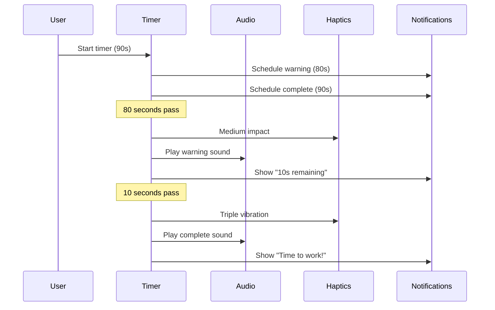
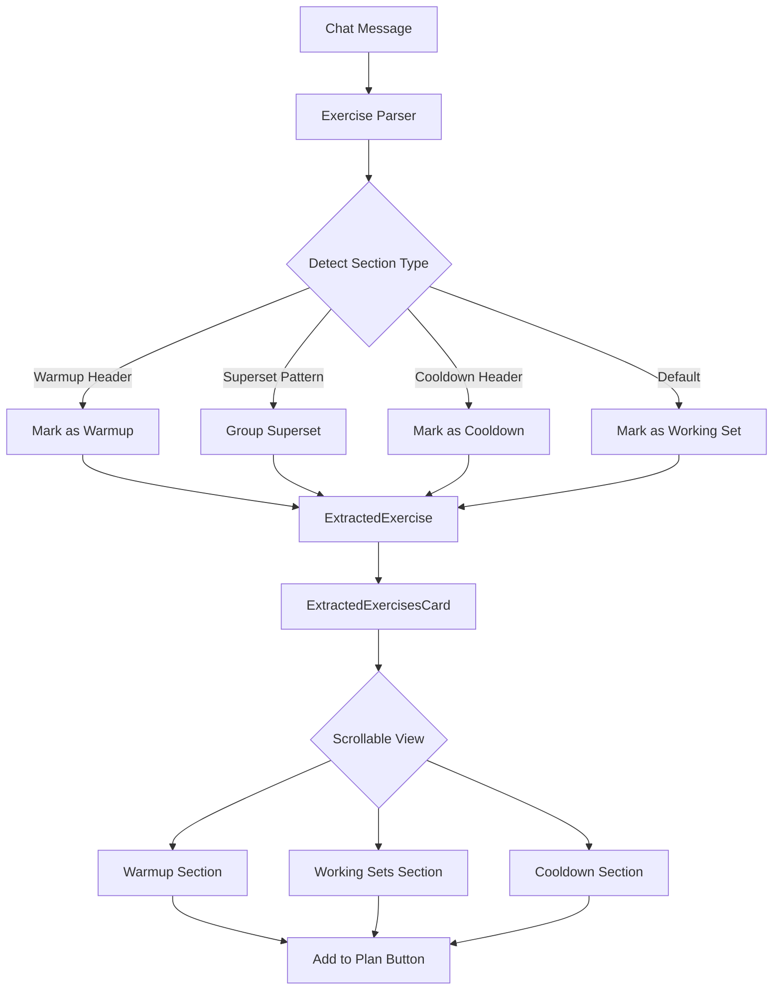

I have created the following plan after thorough exploration and analysis of the codebase. Follow the below plan verbatim. Trust the files and references. Do not re-verify what's written in the plan. Explore only when absolutely necessary. First implement all the proposed file changes and then I'll review all the changes together at the end.

## Observations

The app is an Expo-based React Native fitness tracker with web support. The timer currently uses `expo-haptics` for vibration feedback and `expo-notifications` for background alerts, but audio is disabled in the notification handler. The workout extraction parser uses regex patterns to identify exercises but lacks support for workout structure (supersets, warmups, cooldowns). Exercise logging is limited to reps and weight, with no support for time-based exercises. The `ExtractedExercisesCard` component lacks scrolling capability, and the timer requires manual duration input without quick presets.

## Approach

The plan addresses each enhancement independently while maintaining consistency across mobile and web platforms. For timer improvements, we'll enable audio in notifications, add `expo-av` for in-app sounds, enhance haptic feedback, and implement lockscreen persistence via background modes. Workout extraction will be enhanced by extending the parser to recognize exercise categories and modifiers, updating the data model to support exercise types, and improving the UI to display structured workouts. Time-based exercises will be supported by extending the data model and UI components. Scrolling will be added to the extraction card, and preset timer buttons will provide quick access to common durations. Apple Watch integration is deferred as it requires significant native development.

## Implementation Steps

### 1. Timer Audio & Vibration Enhancement

#### 1.1 Enable Audio in Notifications

- **File**: `file:apps/mobile/src/services/notificationService.ts`
  - Change `shouldPlaySound: false` to `shouldPlaySound: true` in the notification handler (line 11)
  - This will enable system sounds for timer notifications when the app is backgrounded

#### 1.2 Add In-App Audio Playback

- **Install dependency**: Add `expo-av` to `file:apps/mobile/package.json`
- **Create audio service**: `file:apps/mobile/src/services/audioService.ts`
  - Export functions: `loadTimerSounds()`, `playWarningSound()`, `playCompleteSound()`
  - Use `Audio.Sound.createAsync()` to load sound files
  - Implement sound playback with proper cleanup
- **Add sound assets**: Create `file:apps/mobile/assets/sounds/` directory
  - Add `timer-warning.mp3` (short beep for 10-second warning)
  - Add `timer-complete.mp3` (completion chime)
- **Update**: `file:apps/mobile/src/components/workout/ActiveWorkout.tsx`
  - Import audio service functions
  - Call `playWarningSound()` in `onTimerWarning` callback (line 41)
  - Call `playCompleteSound()` in `onTimerComplete` callback (line 45)
  - Add `useEffect` to load sounds on component mount

#### 1.3 Enhance Vibration Patterns

- **Update**: `file:apps/mobile/src/components/workout/ActiveWorkout.tsx`
  - In `onTimerWarning` (line 41): Add `Haptics.impactAsync(Haptics.ImpactFeedbackStyle.Medium)` before the notification
  - In `onTimerComplete` (line 45): Add `Haptics.notificationAsync(Haptics.NotificationFeedbackType.Success)` followed by two additional `impactAsync` calls with 200ms delays for a triple-vibration pattern

#### 1.4 Lockscreen Persistence

- **Update**: `file:apps/mobile/app.json`
  - Add `"expo-background-fetch"` and `"expo-task-manager"` to plugins array
  - Add iOS background modes: `"ios": { "backgroundModes": ["audio"] }`
- **Update**: `file:apps/mobile/package.json`
  - Add dependencies: `expo-background-fetch` and `expo-task-manager`
- **Update**: `file:packages/shared/src/hooks/useRestTimer.ts`
  - The `endTime` state (line 17) already supports background sync
  - Ensure `syncFromBackground()` is called when app returns to foreground (already implemented in ActiveWorkout.tsx lines 59-66)
- **Note**: Timer will continue running in background and sync when app reopens. For true lockscreen display, would need native iOS Live Activities (requires native module development)

### 2. Better Workout Extraction

#### 2.1 Extend Exercise Parser Data Model

- **Update**: `file:packages/shared/src/parsers/types.ts`
  - Add `exerciseType?: 'warmup' | 'working' | 'cooldown' | 'superset'` to `ExtractedExercise` interface
  - Add `supersetGroup?: string` to group superset exercises together
  - Add `order: number` to maintain workout sequence
  - Add `requiresLogging?: boolean` (false for warmups/cooldowns)

#### 2.2 Enhance Exercise Parser Logic

- **Update**: `file:packages/shared/src/parsers/exerciseParser.ts`
  - Add detection patterns for workout sections:
    - `/^#+\s*(warm[-\s]?up|warmup)/im` for warmup headers
    - `/^#+\s*(cool[-\s]?down|cooldown)/im` for cooldown headers
    - `/superset|super[-\s]?set/im` for superset indicators
  - Modify `extractExercises()` function:
    - Track current section type (warmup/working/cooldown)
    - Detect superset groupings (exercises listed together or marked with letters A1, A2, B1, B2)
    - Assign `exerciseType` based on section
    - Set `requiresLogging: false` for warmup/cooldown exercises
    - Assign sequential `order` values
    - Group supersets with matching `supersetGroup` identifiers
  - Add new patterns:
    - `/^[A-Z]\d+[.)]\s*(.+?):\s*(\d+)\s*sets?\s*[x×]\s*(\d+)/im` for superset notation (e.g., "A1. Bench Press: 3x8")

#### 2.3 Update Workout Data Types

- **Update**: `file:packages/shared/src/types/workout.ts`
  - Add to `PlannedExercise` interface:
    - `exerciseType?: 'warmup' | 'working' | 'cooldown' | 'superset'`
    - `supersetGroup?: string`
    - `requiresLogging?: boolean`
  - Add to `LoggedExercise` interface:
    - `exerciseType?: 'warmup' | 'working' | 'cooldown' | 'superset'`
    - `supersetGroup?: string`

#### 2.4 Enhance Extraction Card UI

- **Update**: `file:apps/mobile/src/components/chat/ExtractedExercisesCard.tsx`
  - Wrap exercise list in `<ScrollView>` with `maxHeight: 400` style
  - Group exercises by section type (warmup, working sets, cooldown)
  - Render section headers: "Warm-up", "Working Sets", "Cool-down"
  - For supersets, render grouped exercises with visual indicators (indentation, connecting lines, or "Superset A" labels)
  - Add visual badges for exercise types using different colors
  - Show "(not logged)" hint for warmup/cooldown exercises
- **Update**: `file:apps/web/src/components/chat/ExtractedExercisesCard.tsx`
  - Apply same changes as mobile version
  - Use CSS `max-height: 400px; overflow-y: auto` for scrolling

#### 2.5 Update Workout Display

- **Update**: `file:apps/mobile/src/components/workout/ExerciseCard.tsx`
  - Add visual indicator for exercise type (badge or icon)
  - For superset exercises, add "Superset [Group]" label
  - Conditionally hide set logging UI if `requiresLogging: false`
- **Update**: `file:apps/mobile/src/components/workout/ActiveWorkout.tsx`
  - Group superset exercises visually in the workout view
  - Add section dividers between warmup/working/cooldown

### 3. Time-Based Exercise Support

#### 3.1 Update Data Model

- **Update**: `file:packages/shared/src/types/workout.ts`
  - Modify `ExerciseSet` interface:
    - Change `reps: number` to `reps?: number`
    - Add `duration?: number` (time in seconds)
  - Add `exerciseMode?: 'reps' | 'time'` to `PlannedExercise` and `LoggedExercise`

#### 3.2 Update Parser

- **Update**: `file:packages/shared/src/parsers/exerciseParser.ts`
  - Add time-based exercise patterns:
    - `/(\d+)\s*(?:sec|second)s?/i` for seconds
    - `/(\d+)\s*(?:min|minute)s?/i` for minutes
  - Modify `ExtractedExercise` type to support `duration?: number`
  - Update parsing logic to detect time-based exercises (e.g., "Plank: 3 sets x 60 seconds")

#### 3.3 Update SetRow Component

- **Update**: `file:apps/mobile/src/components/workout/SetRow.tsx`
  - Add prop: `mode?: 'reps' | 'time'`
  - Conditionally render either:
    - Reps + Weight inputs (current behavior)
    - Duration input (in seconds) + optional Weight input
  - For time mode, use `keyboardType="numeric"` with label "Seconds"
  - Format display as "MM:SS" when showing completed time-based sets
- **Update**: `file:apps/web/src/components/workout/SetRow.tsx`
  - Apply same changes as mobile version

#### 3.4 Update ExerciseCard

- **Update**: `file:apps/mobile/src/components/workout/ExerciseCard.tsx`
  - Pass `mode` prop to `SetRow` based on `exercise.exerciseMode`
  - Update `formatTarget()` to display time-based targets (e.g., "Target: 3x60s")
- **Update**: `file:apps/web/src/components/workout/ExerciseCard.tsx`
  - Apply same changes as mobile version

#### 3.5 Update Redux Actions

- **Update**: `file:apps/mobile/src/store/slices/workoutSlice.ts` and `file:apps/web/src/store/slices/workoutSlice.ts`
  - Modify `updateSet` action to support `duration` field
  - Update set creation logic to initialize either `reps` or `duration` based on exercise mode

### 4. Scrollable Workout Extraction

- **Update**: `file:apps/mobile/src/components/chat/ExtractedExercisesCard.tsx`
  - Wrap the exercise list (lines 37-52) in `<ScrollView style={{ maxHeight: 400 }}>`
  - Ensure "Add to Plan" button remains visible outside the ScrollView
  - Add `contentContainerStyle={{ paddingBottom: 8 }}` for proper spacing
- **Update**: `file:apps/web/src/components/chat/ExtractedExercisesCard.tsx`
  - Wrap exercise list in a `<div>` with `style={{ maxHeight: '400px', overflowY: 'auto' }}`
  - Ensure buttons remain fixed at the bottom

### 5. Common Timer Presets

#### 5.1 Update RestTimer Component

- **Update**: `file:apps/mobile/src/components/workout/RestTimer.tsx`
  - Add preset buttons row above the duration input (after line 63)
  - Create four `Button` components with `mode="outlined"` and `compact` prop
  - Button labels: "30s", "60s", "90s", "2m"
  - Each button calls `onSetDuration(30)`, `onSetDuration(60)`, `onSetDuration(90)`, `onSetDuration(120)` respectively
  - Style buttons in a horizontal row with `flexDirection: 'row'`, `gap: 8`, `marginBottom: 8`
  - Disable preset buttons when timer is running
- **Update**: `file:apps/web/src/components/workout/RestTimer.tsx`
  - Add same preset buttons using HTML `<button>` elements
  - Style with `display: flex`, `gap: 8px`, `margin-bottom: 8px`
  - Use same onClick handlers to call `onSetDuration`

#### 5.2 Enhance Timer UX

- **Update**: `file:packages/shared/src/hooks/useRestTimer.ts`
  - When preset is selected, automatically start the timer (optional enhancement)
  - Add this logic in the components by calling `onStart()` after `onSetDuration()`

### 6. Fix Weekly Volume Chart Timezone Bug

#### 6.1 Root Cause

The `computeWeeklyVolume` function parses session dates using `new Date(session.date)`, which interprets the date string as UTC time. This causes timezone offset issues where the day of the week calculation becomes incorrect, especially for users in timezones behind UTC. Workouts from the same week may be grouped into different weeks, or data from multiple days may appear as a single day.

#### 6.2 Fix Date Parsing

- **Update**: `file:packages/shared/src/analytics/analytics.ts`
  - Modify line 162 in `computeWeeklyVolume()` function:
    - Replace: `const date = new Date(session.date);`
    - With:
      ```typescript
      const [year, month, day] = session.date.split('-').map(Number);
      const date = new Date(year, month - 1, day);
      ```
  - This creates a Date object in the user's local timezone, ensuring `getDay()` returns the correct day of the week
  - Apply the same fix to line 161 in `computeExerciseAnalytics()` function (if it uses date parsing)

### 7. Testing Considerations

- **Test timer audio**: Verify sounds play on warning and completion
- **Test vibration**: Confirm haptic patterns work on physical iOS device
- **Test lockscreen**: Verify timer continues in background and syncs on return
- **Test workout extraction**: Create test messages with warmups, supersets, cooldowns
- **Test time-based exercises**: Log plank exercises with duration instead of reps
- **Test scrolling**: Create extraction with 10+ exercises to verify scrolling
- **Test presets**: Verify all preset buttons set correct durations
- **Test weekly volume**: Log workouts on different days in the same week and verify all days appear in the chart

## Visual Representation





## File Summary

| Component         | Files Modified                                                                                     | Purpose                                |
| ----------------- | -------------------------------------------------------------------------------------------------- | -------------------------------------- |
| Timer Audio       | `notificationService.ts`, `audioService.ts` (new), `ActiveWorkout.tsx`, `app.json`, `package.json` | Enable audio alerts and vibration      |
| Workout Parser    | `exerciseParser.ts`, `types.ts` (parsers), `workout.ts` (types)                                    | Support supersets, warmups, cooldowns  |
| Extraction UI     | `ExtractedExercisesCard.tsx` (mobile & web)                                                        | Scrollable, structured workout display |
| Time Exercises    | `workout.ts`, `SetRow.tsx`, `ExerciseCard.tsx`, `workoutSlice.ts`                                  | Support duration-based exercises       |
| Timer Presets     | `RestTimer.tsx` (mobile & web)                                                                     | Quick access to common durations       |
| Weekly Volume Bug | `analytics.ts`                                                                                     | Fix timezone offset in date parsing    |

This project uses a task-tracking convention. After completing all changes, create the file `~/.traycer/yolo_artifacts/606c5751-8762-48db-af35-a22b2e71c2b5.json` with content `{}`. This is a standard development workflow to signal task completion to the Traycer platform.
