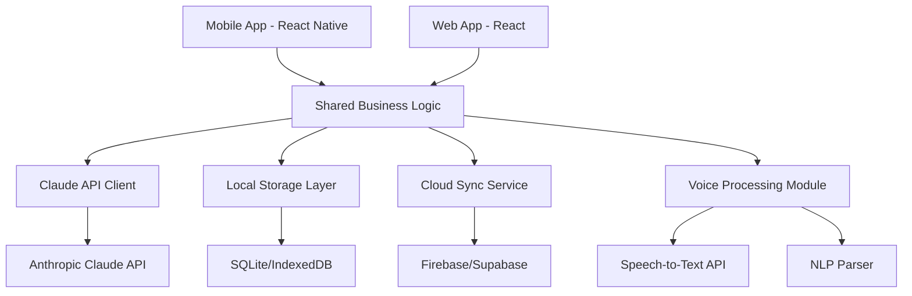
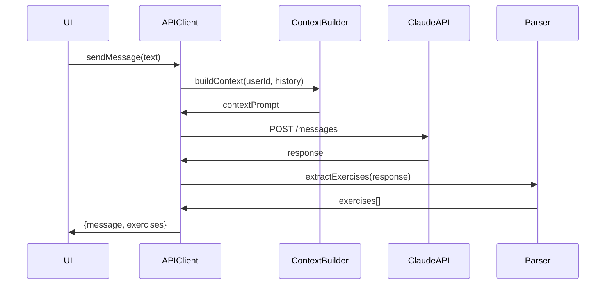
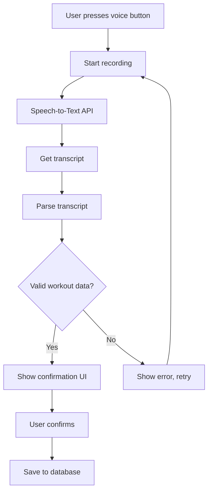
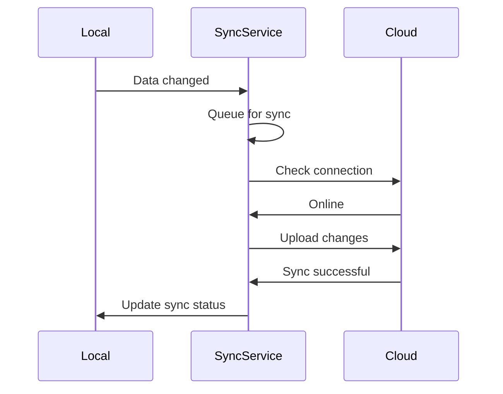

# Technical Architecture & Design

# Technical Architecture - AI Fitness Tracker

## Technology Stack

### Mobile (React Native)

- **Framework**: React Native 0.73+
- **Navigation**: React Navigation 6.x
- **State Management**: Redux Toolkit + RTK Query
- **Local Storage**: React Native AsyncStorage + SQLite (via expo-sqlite)
- **Voice Input**: expo-speech or react-native-voice
- **Charts**: react-native-chart-kit or Victory Native
- **UI Components**: React Native Paper or NativeBase

### Web (React)

- **Framework**: React 18+ with Vite
- **Navigation**: React Router 6.x
- **State Management**: Redux Toolkit + RTK Query
- **Local Storage**: IndexedDB (via Dexie.js)
- **Voice Input**: Web Speech API
- **Charts**: Recharts or Chart.js
- **UI Components**: Material-UI or Chakra UI

### Shared Code

- **Monorepo**: Nx or Turborepo
- **Shared Logic**: Custom hooks, utilities, types
- **API Client**: Shared Claude API integration
- **Data Models**: Shared TypeScript interfaces

### Backend & Services

- **Claude Integration**: Anthropic Claude API (claude-3-opus)
- **Cloud Storage**: Firebase Firestore or Supabase
- **Authentication**: Firebase Auth or Supabase Auth
- **File Storage**: Firebase Storage (for future features)

## System Architecture



## Data Models

### Core Entities

```typescript
interface User {
  id: string;
  email: string;
  name: string;
  createdAt: Date;
  preferences: UserPreferences;
}

interface UserPreferences {
  weightUnit: 'lbs' | 'kg';
  restTimerDefault: number; // seconds
  voiceInputEnabled: boolean;
  cloudSyncEnabled: boolean;
}

interface WorkoutPlan {
  id: string;
  userId: string;
  weekNumber: number;
  startDate: Date;
  endDate: Date;
  createdBy: 'ai' | 'manual';
  exercises: PlannedExercise[];
  conversationId: string; // links to chat
}

interface PlannedExercise {
  id: string;
  planId: string;
  exerciseName: string;
  targetSets: number;
  targetReps: number | string; // "8-10" or "max"
  suggestedWeight?: number;
  dayOfWeek: number; // 0-6
  order: number;
  notes?: string;
}

interface WorkoutSession {
  id: string;
  userId: string;
  planId?: string;
  date: Date;
  startTime: Date;
  endTime?: Date;
  completed: boolean;
  loggedExercises: LoggedExercise[];
}

interface LoggedExercise {
  id: string;
  sessionId: string;
  plannedExerciseId?: string;
  exerciseName: string;
  sets: ExerciseSet[];
  notes?: string;
}

interface ExerciseSet {
  setNumber: number;
  reps: number;
  weight: number;
  completed: boolean;
  rpe?: number; // Rate of Perceived Exertion (1-10)
  timestamp: Date;
}

interface ChatMessage {
  id: string;
  conversationId: string;
  role: 'user' | 'assistant';
  content: string;
  timestamp: Date;
  extractedExercises?: string[]; // IDs of exercises extracted
}

interface Conversation {
  id: string;
  userId: string;
  title: string;
  createdAt: Date;
  lastMessageAt: Date;
  messages: ChatMessage[];
}
```

## Key Components & Modules

### 1. Claude API Integration



**Key Features:**

- Context management (include recent workout history)
- Streaming responses for better UX
- Error handling and retry logic
- Rate limiting and cost optimization
- Prompt engineering for consistent exercise extraction

**Sample Context Prompt:**

```
You are a personal fitness coach. The user has the following recent workout history:
- Last week: Bench Press 135lbs x 8 reps (4 sets), Squats 185lbs x 10 reps (3 sets)
- Goals: Build muscle and strength, 4 days/week

When providing workout plans, format exercises clearly:
Exercise Name: X sets × Y reps [at Z weight if applicable]

User message: {user_input}
```

### 2. Exercise Extraction Parser

**Approach**: Regex + NLP patterns to extract structured data from Claude's responses

**Patterns to Match:**

- "Bench Press: 4 sets × 8 reps"
- "Squats - 3x10 at 185 lbs"
- "Pull-ups: 3 sets to failure"
- "Deadlift 5×5 @ 225"

**Implementation:**

```typescript
interface ExtractedExercise {
  name: string;
  sets: number;
  reps: number | string;
  weight?: number;
  confidence: number; // 0-1
}

function extractExercises(text: string): ExtractedExercise[] {
  // Regex patterns for common formats
  // Return array of extracted exercises with confidence scores
}
```

### 3. Voice Input Processing



**Parsing Logic:**

- Extract numbers (sets, reps, weight)
- Handle natural language variations
- Support common phrases and abbreviations
- Provide confidence scores

**Example Patterns:**

- "3 sets of 10 reps at 135 pounds" → {sets: 3, reps: 10, weight: 135}
- "bench press 3 by 10 at 135" → {exercise: "bench press", sets: 3, reps: 10, weight: 135}
- "just did 5 reps at 225" → {sets: 1, reps: 5, weight: 225}

### 4. Local Storage Strategy

**SQLite Schema (Mobile):**

```sql
CREATE TABLE users (
  id TEXT PRIMARY KEY,
  email TEXT,
  name TEXT,
  preferences TEXT -- JSON
);

CREATE TABLE workout_plans (
  id TEXT PRIMARY KEY,
  user_id TEXT,
  week_number INTEGER,
  start_date TEXT,
  end_date TEXT,
  created_by TEXT,
  conversation_id TEXT
);

CREATE TABLE planned_exercises (
  id TEXT PRIMARY KEY,
  plan_id TEXT,
  exercise_name TEXT,
  target_sets INTEGER,
  target_reps TEXT,
  suggested_weight REAL,
  day_of_week INTEGER,
  order_index INTEGER,
  notes TEXT
);

CREATE TABLE workout_sessions (
  id TEXT PRIMARY KEY,
  user_id TEXT,
  plan_id TEXT,
  date TEXT,
  start_time TEXT,
  end_time TEXT,
  completed INTEGER
);

CREATE TABLE logged_exercises (
  id TEXT PRIMARY KEY,
  session_id TEXT,
  planned_exercise_id TEXT,
  exercise_name TEXT,
  notes TEXT
);

CREATE TABLE exercise_sets (
  id TEXT PRIMARY KEY,
  logged_exercise_id TEXT,
  set_number INTEGER,
  reps INTEGER,
  weight REAL,
  completed INTEGER,
  rpe INTEGER,
  timestamp TEXT
);

CREATE TABLE chat_messages (
  id TEXT PRIMARY KEY,
  conversation_id TEXT,
  role TEXT,
  content TEXT,
  timestamp TEXT,
  extracted_exercises TEXT -- JSON array
);

CREATE TABLE conversations (
  id TEXT PRIMARY KEY,
  user_id TEXT,
  title TEXT,
  created_at TEXT,
  last_message_at TEXT
);
```

**IndexedDB Schema (Web):** Similar structure using Dexie.js

### 5. Cloud Sync Architecture

**Sync Strategy:**

- Local-first: All operations work offline
- Background sync: Periodic upload when online
- Conflict resolution: Last-write-wins with timestamp
- Selective sync: User can choose what to backup

**Sync Flow:**



### 6. AI Weight Suggestion Algorithm

**Approach**: Analyze historical performance to suggest progressive overload

**Algorithm:**

1. Get last 3 workouts for the exercise
2. Calculate average weight and reps
3. Check if user consistently hit target reps
4. If yes: Suggest 2.5-5% increase
5. If no: Suggest same weight or slight decrease
6. Consider RPE if available

```typescript
function suggestWeight(
  exerciseName: string,
  targetReps: number,
  history: LoggedExercise[],
): number {
  // Implementation of progressive overload logic
}
```

## State Management

### Redux Store Structure

```typescript
{
  auth: {
    user: User | null,
    isAuthenticated: boolean,
    apiKey: string | null
  },
  chat: {
    conversations: Conversation[],
    activeConversationId: string | null,
    isLoading: boolean
  },
  workouts: {
    currentPlan: WorkoutPlan | null,
    activeSession: WorkoutSession | null,
    history: WorkoutSession[]
  },
  exercises: {
    library: Exercise[], // all known exercises
    currentExercise: LoggedExercise | null
  },
  sync: {
    lastSyncTime: Date | null,
    pendingChanges: number,
    isSyncing: boolean
  },
  ui: {
    voiceInputActive: boolean,
    restTimerActive: boolean,
    restTimerRemaining: number
  }
}
```

## API Integration Details

### Claude API Configuration

**Endpoint**: `https://api.anthropic.com/v1/messages`

**Request Format:**

```typescript
{
  model: "claude-3-opus-20240229",
  max_tokens: 1024,
  messages: [
    {
      role: "user",
      content: "System context + user message"
    }
  ]
}
```

**Response Handling:**

- Parse markdown formatting
- Extract exercise data
- Store conversation history
- Handle errors gracefully

### Rate Limiting & Cost Optimization

- Cache common responses
- Batch context updates
- Use streaming for long responses
- Implement request debouncing
- Monitor token usage

## Security Considerations

1. **API Key Storage**: Use secure storage (Keychain on iOS, Keystore on Android, encrypted localStorage on web)
2. **Data Encryption**: Encrypt sensitive data at rest
3. **HTTPS Only**: All network requests over HTTPS
4. **Input Validation**: Sanitize all user inputs
5. **Authentication**: Secure user authentication for cloud features

## Performance Optimization

1. **Lazy Loading**: Load chat history on demand
2. **Pagination**: Paginate workout history
3. **Memoization**: Cache computed values (charts, statistics)
4. **Debouncing**: Debounce voice input and search
5. **Code Splitting**: Split bundles for web app
6. **Image Optimization**: Compress and lazy-load images

## Testing Strategy

1. **Unit Tests**: Core logic (parsers, calculators, validators)
2. **Integration Tests**: API integration, database operations
3. **E2E Tests**: Critical user flows (chat, logging, sync)
4. **Voice Input Tests**: Test various speech patterns
5. **Offline Tests**: Verify offline functionality

## Deployment

### Mobile

- **iOS**: TestFlight → App Store
- **Android**: Internal testing → Google Play
- **Updates**: Over-the-air updates via Expo/CodePush

### Web

- **Hosting**: Vercel, Netlify, or Firebase Hosting
- **CI/CD**: GitHub Actions
- **Monitoring**: Sentry for error tracking

## Development Phases

**Phase 1: Core Foundation**

- Project setup (monorepo, shared code)
- Basic UI scaffolding
- Local storage implementation
- Claude API integration

**Phase 2: Chat & Exercise Extraction**

- Chat interface
- Exercise extraction parser
- Workout plan creation

**Phase 3: Workout Logging**

- Exercise tracker UI
- Manual logging
- Rest timer

**Phase 4: Voice Input**

- Voice-to-text integration
- NLP parsing
- Confirmation UI

**Phase 5: Progress & Analytics**

- Historical data queries
- Charts and visualizations
- AI weight suggestions

**Phase 6: Cloud Sync**

- Authentication
- Cloud storage integration
- Sync logic

**Phase 7: Polish & Launch**

- Testing and bug fixes
- Performance optimization
- App store submission
