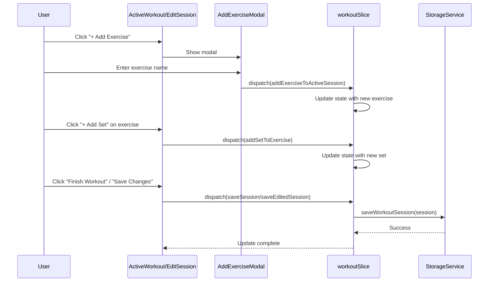

I have created the following plan after thorough exploration and analysis of the codebase. Follow the below plan verbatim. Trust the files and references. Do not re-verify what's written in the plan. Explore only when absolutely necessary. First implement all the proposed file changes and then I'll review all the changes together at the end.

## Observations

The workout app currently supports logging exercises and sets from a pre-defined workout plan, but lacks the ability to dynamically add new exercises or sets during an active workout session or when editing past sessions. The codebase uses Redux for state management (file:`packages/shared/src/types/workout.ts` defines the data models), with separate implementations for web (file:`apps/web/src/components/workout/ActiveWorkout.tsx`) and mobile (file:`apps/mobile/src/components/workout/ActiveWorkout.tsx`) that share the same Redux slice (file:`apps/web/src/store/slices/workoutSlice.ts`). The existing modal pattern (file:`apps/web/src/components/voice/VoiceInputModal.tsx`) provides a good reference for implementing new UI components.

## Approach

The implementation will add two core features: adding exercises and adding sets to existing exercises. This requires changes at three layers: Redux state management, UI components, and storage persistence. The approach prioritizes consistency across web and mobile platforms by implementing shared Redux actions first, then building platform-specific UI components that follow existing design patterns. The solution will work for both active workout sessions and when editing historical workouts, ensuring a unified experience.

## Implementation Steps

### 1. Redux State Management Updates

**File:** `file:apps/web/src/store/slices/workoutSlice.ts` and `file:apps/mobile/src/store/slices/workoutSlice.ts`

Add new reducer actions to the `workoutSlice`:

- **`addExerciseToActiveSession`** - Adds a new `LoggedExercise` to `activeSession.loggedExercises[]`
  - Parameters: `exerciseName: string`, `notes?: string`
  - Generate new exercise ID using `generateId()` from `@fitness-tracker/shared`
  - Initialize with empty sets array
  - Append to the end of the exercises list

- **`addExerciseToEditSession`** - Same functionality for `editingSession`
  - Mirror the logic from active session
  - Ensures consistency when editing past workouts

- **`addSetToExercise`** - Adds a new `ExerciseSet` to a specific exercise in `activeSession`
  - Parameters: `exerciseIndex: number`
  - Calculate next set number based on existing sets length
  - Initialize with: `reps: 0`, `weight: 0`, `completed: false`, `timestamp: ''`
  - Copy weight from previous set if available for convenience

- **`addSetToEditExercise`** - Same functionality for `editingSession`
  - Mirror the logic from active session

- **`removeExerciseFromActiveSession`** - Remove an exercise by index (optional enhancement)
  - Parameters: `exerciseIndex: number`
  - Filter out the exercise from the array

- **`removeSetFromExercise`** - Remove a set by exercise and set index (optional enhancement)
  - Parameters: `exerciseIndex: number`, `setIndex: number`
  - Filter out the set and renumber remaining sets

### 2. Web UI Components

#### 2.1 Add Exercise Modal Component

**New File:** `file:apps/web/src/components/workout/AddExerciseModal.tsx`

Create a modal component following the pattern from `VoiceInputModal`:

- Form fields:
  - Exercise name (text input, required)
  - Notes (textarea, optional)
- Buttons: Cancel, Add Exercise
- Styling: Use existing `overlayStyle` and `modalStyle` patterns
- On submit: Dispatch `addExerciseToActiveSession` or `addExerciseToEditSession` based on context
- Validation: Ensure exercise name is not empty

#### 2.2 Update ExerciseCard Component

**File:** `file:apps/web/src/components/workout/ExerciseCard.tsx`

Add "Add Set" button after the last set:

- Button placement: Below all existing `SetRow` components
- Button text: "+ Add Set"
- Styling: Subtle, secondary button style (similar to existing patterns)
- Props: Add `onAddSet?: (exerciseIndex: number) => void` callback
- On click: Call `onAddSet(exerciseIndex)`

#### 2.3 Update ActiveWorkout Component

**File:** `file:apps/web/src/components/workout/ActiveWorkout.tsx`

Add "Add Exercise" functionality:

- Add state: `const [showAddExercise, setShowAddExercise] = useState(false)`
- Add button: Place after all exercise cards, before "Finish Workout" button
- Button text: "+ Add Exercise"
- Styling: Secondary button with dashed border to indicate addition
- Handler: `handleAddExercise` - opens modal
- Handler: `handleAddSet` - dispatches `addSetToExercise` action
- Pass `onAddSet={handleAddSet}` to each `ExerciseCard`
- Render `AddExerciseModal` when `showAddExercise` is true

#### 2.4 Update EditWorkoutSession Component

**File:** `file:apps/web/src/components/workout/EditWorkoutSession.tsx`

Apply same changes as `ActiveWorkout`:

- Add "Add Exercise" button
- Pass `onAddSet` handler to `ExerciseCard` components
- Use `addExerciseToEditSession` and `addSetToEditExercise` actions
- Ensure added exercises/sets are saved when "Save Changes" is clicked

### 3. Mobile UI Components

#### 3.1 Add Exercise Modal Component

**New File:** `file:apps/mobile/src/components/workout/AddExerciseModal.tsx`

Create React Native modal using `react-native-paper`:

- Use `Modal`, `Portal`, `TextInput`, `Button` from `react-native-paper`
- Form fields:
  - Exercise name (`TextInput` with label)
  - Notes (`TextInput` with `multiline` prop)
- Buttons: Cancel (text button), Add (contained button)
- Styling: Follow existing mobile component patterns
- On submit: Dispatch appropriate Redux action

#### 3.2 Update ExerciseCard Component

**File:** `file:apps/mobile/src/components/workout/ExerciseCard.tsx`

Add "Add Set" button:

- Use `Button` from `react-native-paper` with `mode="outlined"`
- Place after all `SetRow` components
- Icon: Plus icon from `react-native-paper` icons
- Props: Add `onAddSet?: (exerciseIndex: number) => void`
- Styling: Consistent with existing mobile styles

#### 3.3 Update ActiveWorkout Component

**File:** `file:apps/mobile/src/components/workout/ActiveWorkout.tsx`

Add "Add Exercise" functionality:

- Add state for modal visibility
- Add `Button` with `mode="outlined"` after exercises
- Icon: Plus icon
- Handler functions for adding exercise and sets
- Render `AddExerciseModal` component
- Pass `onAddSet` to `ExerciseCard` components

#### 3.4 Update EditWorkoutSession Component

**File:** `file:apps/mobile/src/components/workout/EditWorkoutSession.tsx`

Apply same changes as mobile `ActiveWorkout`:

- Add exercise and set functionality
- Use edit-specific Redux actions

### 4. Storage Persistence

No changes required - the existing `saveSession` and `saveEditedSession` async thunks in the Redux slice already persist the entire session object to storage via `storage.saveWorkoutSession()`. The new exercises and sets will be automatically saved when these actions are dispatched.

### 5. Type Safety Verification

Ensure all new code properly uses existing types from `file:packages/shared/src/types/workout.ts`:

- `LoggedExercise` interface for new exercises
- `ExerciseSet` interface for new sets
- Verify `generateId()` is imported from `@fitness-tracker/shared`

### 6. Testing Considerations

Manual testing scenarios:

- Add exercise during active workout → verify it appears and can be edited
- Add set to existing exercise → verify set numbering is correct
- Add exercise/set in edit mode → verify changes persist after save
- Test on both web and mobile platforms
- Verify sync functionality works with added exercises/sets

## Visual Flow Diagram



## Component Hierarchy

```
ActiveWorkout / EditWorkoutSession
├── AddExerciseModal (new)
│   └── Form inputs + buttons
├── ExerciseCard (updated)
│   ├── SetRow (existing)
│   ├── SetRow (existing)
│   └── "+ Add Set" button (new)
└── "+ Add Exercise" button (new)
```

This project uses a task-tracking convention. After completing all changes, create the file `~/.traycer/yolo_artifacts/14645aed-7204-4adc-a0f0-4e04604cc869.json` with content `{}`. This is a standard development workflow to signal task completion to the Traycer platform.
