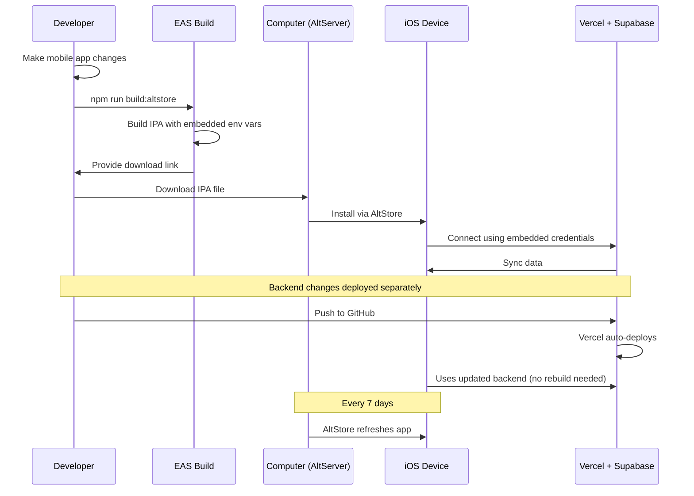

I have created the following plan after thorough exploration and analysis of the codebase. Follow the below plan verbatim. Trust the files and references. Do not re-verify what's written in the plan. Explore only when absolutely necessary. First implement all the proposed file changes and then I'll review all the changes together at the end.

## Observations

Your mobile app is built with Expo SDK 54 and currently has three EAS build profiles (development, development-simulator, preview) configured for internal distribution. The app connects to Supabase backend using environment variables (`EXPO_PUBLIC_SUPABASE_URL` and `EXPO_PUBLIC_SUPABASE_ANON_KEY`) that are baked into the build at compile time. Your web app is deployed on Vercel and shares the same Supabase backend. The bundle identifier is `com.alexsalman.gainius` and you have an EAS project ID configured.

## Approach

Create a dedicated "altstore" build profile in `file:apps/mobile/eas.json` optimized for AltStore sideloading with ad-hoc distribution. This profile will generate an IPA file that can be installed via AltStore while maintaining full connectivity to your Vercel-hosted backend. The approach leverages EAS Build's internal distribution to create a downloadable IPA, ensures environment variables are properly embedded, and provides a complete workflow for building, downloading, and sideloading through AltStore. The backend architecture remains unchanged since AltStore only affects app distribution, not runtime behavior.

## Implementation Steps

### 1. Update EAS Build Configuration

Modify `file:apps/mobile/eas.json` to add the "altstore" build profile:

**Add new profile under the `build` section:**

- Profile name: `"altstore"`
- Set `"distribution": "internal"` (generates downloadable IPA)
- Set `"ios.simulator": false` (builds for physical devices)
- Embed environment variables directly in the profile using the `env` object
- Include `EXPO_PUBLIC_SUPABASE_URL` and `EXPO_PUBLIC_SUPABASE_ANON_KEY` from your existing `.env` file
- Optionally add `"ios.buildConfiguration": "Release"` for optimized performance

**Example structure:**

```json
"altstore": {
  "distribution": "internal",
  "ios": {
    "simulator": false,
    "buildConfiguration": "Release"
  },
  "env": {
    "EXPO_PUBLIC_SUPABASE_URL": "https://smhwwctqrualehwthkvf.supabase.co",
    "EXPO_PUBLIC_SUPABASE_ANON_KEY": "sb_publishable_Mh6mcF_I_kdwKpv46duIaA_TZIuiMZH"
  }
}
```

### 2. Add Build Script to Package.json

Update `file:apps/mobile/package.json` scripts section:

**Add new script:**

- Script name: `"build:altstore"`
- Command: `"eas build --profile altstore --platform ios"`
- This provides a convenient shortcut for building the AltStore-compatible IPA

**Optional additional scripts:**

- `"build:altstore:local"`: `"eas build --profile altstore --platform ios --local"` (builds locally if you have Xcode installed)

### 3. Verify App Configuration

Review `file:apps/mobile/app.json` to ensure compatibility:

**Required fields (already configured):**

- `expo.ios.bundleIdentifier`: "com.alexsalman.gainius" ✓
- `expo.version`: "1.0.0" ✓
- `expo.extra.eas.projectId`: "29eb6bfc-125e-4ab4-9c4b-c8f046538abb" ✓

**Optional enhancements:**

- Add `expo.ios.buildNumber` if not present (increment for each build)
- Consider updating `expo.userInterfaceStyle` to support both "light" and "dark" or "automatic" for the dark mode you implemented

### 4. Create AltStore Sideloading Documentation

Create new documentation file `file:docs/altstore-sideloading-guide.md`:

#### Section 1: Prerequisites

- Mac or Windows computer with AltServer installed
- AltStore app installed on iOS device (iOS 14.0 or later)
- Developer Mode enabled on iOS device (Settings → Privacy & Security → Developer Mode)
- Apple ID credentials (can be personal account, no paid developer account needed)
- iTunes and iCloud installed (download from Apple, not Microsoft Store)
- iOS device and computer on same Wi-Fi network
- USB cable for initial AltStore setup

#### Section 2: Building the IPA

**Step-by-step process:**

1. Navigate to mobile app directory: `cd apps/mobile`
2. Ensure you're logged into EAS: `eas login`
3. Run build command: `npm run build:altstore`
4. Wait for build completion (typically 15-30 minutes)
5. EAS will provide a download link in the terminal and dashboard
6. Download the `.ipa` file to your computer
7. Note the build number and version for tracking

**Build verification:**

- Check EAS dashboard at `https://expo.dev/accounts/alexsalman/projects/ai-fitness-tracker/builds`
- Verify build status shows "Finished"
- Confirm file size is reasonable (typically 50-150 MB)

#### Section 3: Installing via AltStore

**Installation steps:**

1. Open AltServer on your computer (should be running in system tray/menu bar)
2. Connect iOS device via USB (first time only)
3. In AltServer, select "Install AltStore" → choose your device
4. Enter Apple ID credentials when prompted
5. Trust the developer certificate on iOS device (Settings → General → VPN & Device Management)
6. Open AltStore app on iOS device
7. Tap "My Apps" tab
8. Tap "+" button to sideload an app
9. Navigate to the downloaded `.ipa` file (use Files app or AirDrop to transfer to device)
10. AltStore will install the app (may take 1-2 minutes)
11. App appears on home screen as "AI Fitness Tracker"

**Important limitations:**

- Free Apple ID: Maximum 3 sideloaded apps at once
- Apps expire after 7 days and must be refreshed
- AltStore must refresh apps while device and computer are on same Wi-Fi
- Enable "Background Refresh" for AltStore to auto-refresh apps

#### Section 4: Refreshing Sideloaded Apps

**Automatic refresh:**

- Keep AltServer running on your computer
- Ensure iOS device and computer are on same Wi-Fi network
- AltStore will automatically refresh apps in background (if Background Refresh is enabled)
- Apps refresh when expiration is within 1-2 days

**Manual refresh:**

- Open AltStore app
- Go to "My Apps" tab
- Tap "Refresh All" button
- Enter Apple ID password if prompted

#### Section 5: Backend Connectivity

**How it works:**

- The sideloaded app contains the same environment variables as any other build
- `EXPO_PUBLIC_SUPABASE_URL` and `EXPO_PUBLIC_SUPABASE_ANON_KEY` are embedded at build time
- App connects to Supabase backend exactly like TestFlight or App Store builds
- Vercel backend is completely unaffected - it only serves the web app
- All sync, authentication, and data operations work identically

**Testing backend connection:**

1. Launch sideloaded app
2. Sign in with your account
3. Verify sync status in Settings
4. Create a workout and check if it syncs to web app
5. Make changes on web app and verify they sync to mobile

**Troubleshooting connectivity:**

- Check Settings screen for sync status
- Verify you're signed in with correct account
- Ensure device has internet connection
- Check Supabase dashboard for API usage/errors
- Review app logs if available

#### Section 6: Making Backend Changes

**Development workflow:**

- Backend changes are deployed to Vercel via GitHub (existing workflow)
- Web app updates are instant (Vercel deployment)
- Mobile app continues to work with updated backend APIs
- No need to rebuild mobile app unless you change mobile-specific code

**When to rebuild mobile app:**

- Changes to mobile UI/UX components
- Updates to mobile-specific dependencies
- Changes to environment variables
- Native module updates
- Version bumps

**When backend changes don't require mobile rebuild:**

- Supabase schema changes (handled by sync engine)
- API endpoint modifications (if backward compatible)
- RLS policy updates
- Database function changes
- Vercel configuration changes

#### Section 7: Version Management

**Tracking versions:**

- Increment `expo.version` in `file:apps/mobile/app.json` for each release
- Increment `expo.ios.buildNumber` for each build
- Document changes in `file:docs/changelog.md`
- Tag builds in EAS dashboard with descriptive names

**Recommended versioning:**

- Development/testing: 1.0.0-alpha.1, 1.0.0-alpha.2, etc.
- Beta testing: 1.0.0-beta.1, 1.0.0-beta.2, etc.
- Production: 1.0.0, 1.0.1, 1.1.0, etc.

#### Section 8: Troubleshooting Common Issues

**Build fails on EAS:**

- Check build logs in EAS dashboard
- Verify all dependencies are compatible with Expo SDK 54
- Ensure `eas.json` syntax is valid JSON
- Check for TypeScript errors: `npm run typecheck`

**IPA won't install via AltStore:**

- Verify you haven't exceeded 3 app limit (free Apple ID)
- Check that Developer Mode is enabled on iOS device
- Ensure AltServer is running on computer
- Try restarting AltStore app
- Verify `.ipa` file isn't corrupted (re-download if needed)

**App crashes on launch:**

- Check if environment variables are correctly embedded
- Verify bundle identifier matches provisioning profile
- Review crash logs in iOS Settings → Privacy & Security → Analytics & Improvements
- Test with a fresh build

**Sync not working:**

- Verify Supabase credentials in build
- Check network connectivity
- Review Supabase dashboard for errors
- Ensure RLS policies allow your user access
- Check sync status in Settings screen

**App expired/won't open:**

- Refresh app via AltStore (must be within 7 days)
- If expired, reinstall the app (data may be lost unless synced)
- Enable automatic refresh in AltStore settings

### 5. Environment Variable Security

**Current setup:**

- Environment variables are in `file:apps/mobile/.env`
- Variables are embedded in build at compile time
- No runtime configuration needed

**Security considerations:**

- The Supabase anon key is public-facing (safe to embed)
- Row Level Security (RLS) policies protect user data
- Never embed service role keys or private keys
- Consider using different Supabase projects for dev/production

**For production builds:**

- Create separate Supabase project for production
- Use EAS Secrets for sensitive values: `eas secret:create --scope project --name EXPO_PUBLIC_SUPABASE_ANON_KEY --value your-key`
- Reference secrets in `eas.json`: `"EXPO_PUBLIC_SUPABASE_ANON_KEY": "$EXPO_PUBLIC_SUPABASE_ANON_KEY"`
- Update `.gitignore` to exclude `.env.production`

### 6. Testing Workflow

**Recommended testing process:**

1. Make changes to mobile app code
2. Test locally: `npm run ios` (in simulator)
3. Build for AltStore: `npm run build:altstore`
4. Download and install IPA via AltStore
5. Test on physical device
6. Verify backend connectivity
7. Test sync with web app
8. Document any issues

**Parallel development:**

- Continue making backend changes via Vercel/GitHub
- Deploy backend changes independently
- Mobile app automatically uses updated backend
- Only rebuild mobile when mobile code changes

### 7. Comparison: AltStore vs TestFlight

**AltStore advantages:**

- No Apple Developer account required ($99/year)
- Instant distribution (no App Store review)
- Full control over updates
- Good for personal testing

**AltStore limitations:**

- 7-day expiration (requires refresh)
- 3 app limit with free Apple ID
- Requires computer with AltServer running
- Not suitable for distributing to many testers

**When to use each:**

- AltStore: Personal testing, rapid iteration, avoiding App Store review
- TestFlight: Beta testing with multiple users, longer testing periods, professional distribution

### 8. Migration Path to TestFlight

**If you later want to use TestFlight:**

- The existing `preview` profile in `eas.json` is already configured
- Run: `npm run build:preview`
- Submit to TestFlight: `eas submit --platform ios`
- No code changes needed - same app, different distribution
- Backend connectivity remains identical

## Visual Workflow



## Summary

This implementation enables AltStore sideloading while maintaining your existing Vercel backend architecture. The key insight is that AltStore only changes how the app is distributed to your device - the app itself functions identically to any other build. Your Vercel backend remains completely unchanged, and you can continue deploying backend updates through GitHub as usual. The mobile app only needs rebuilding when you modify mobile-specific code, not when you update the backend.

This project uses a task-tracking convention. After completing all changes, create the file `~/.traycer/yolo_artifacts/f3c51c6d-8011-47ca-a944-88be7c61dfc0.json` with content `{}`. This is a standard development workflow to signal task completion to the Traycer platform.
