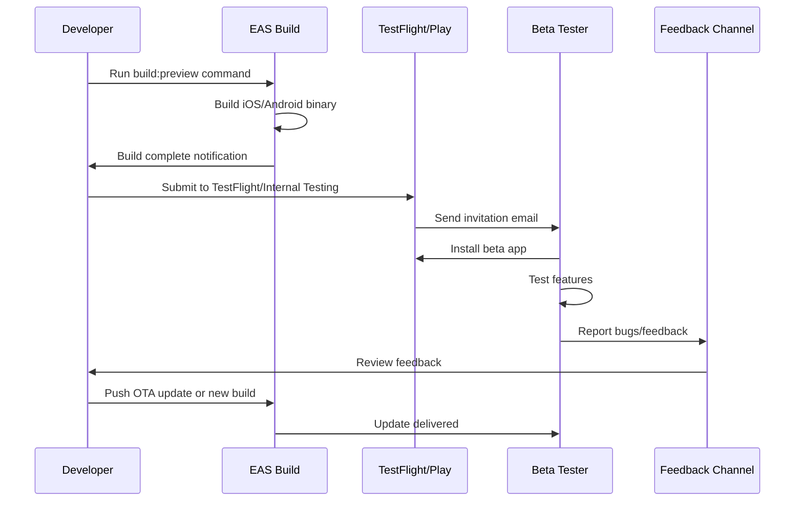

I have created the following plan after thorough exploration and analysis of the codebase. Follow the below plan verbatim. Trust the files and references. Do not re-verify what's written in the plan. Explore only when absolutely necessary. First implement all the proposed file changes and then I'll review all the changes together at the end.

## Observations

The mobile app currently uses Expo SDK 54 with basic configuration. Environment variables are managed via `.env` file with `EXPO_PUBLIC_` prefix for Supabase credentials. No EAS Build configuration exists, and expo-updates is not installed. The app lacks bundle identifiers, version management strategy, and build profiles needed for beta distribution through TestFlight and Google Play Internal Testing.

## Approach

Implement a complete beta testing infrastructure using EAS Build with three build profiles (development, preview, production). Configure environment-specific variables, add expo-updates for OTA capabilities, and establish proper versioning. Create comprehensive documentation covering the entire beta testing workflow from build creation to tester distribution on both iOS and Android platforms.

## Implementation Steps

### 1. Install Required Dependencies

Add expo-updates to `file:apps/mobile/package.json`:

- Add `"expo-updates": "~0.26.0"` to dependencies section
- Run `npm install` from the mobile app directory

### 2. Create EAS Build Configuration

Create new file `file:apps/mobile/eas.json`:

```json
{
  "cli": {
    "version": ">= 13.2.0"
  },
  "build": {
    "development": {
      "developmentClient": true,
      "distribution": "internal",
      "env": {
        "EXPO_PUBLIC_SUPABASE_URL": "https://smhwwctqrualehwthkvf.supabase.co",
        "EXPO_PUBLIC_SUPABASE_ANON_KEY": "sb_publishable_Mh6mcF_I_kdwKpv46duIaA_TZIuiMZH"
      }
    },
    "preview": {
      "distribution": "internal",
      "env": {
        "EXPO_PUBLIC_SUPABASE_URL": "https://smhwwctqrualehwthkvf.supabase.co",
        "EXPO_PUBLIC_SUPABASE_ANON_KEY": "sb_publishable_Mh6mcF_I_kdwKpv46duIaA_TZIuiMZH"
      }
    },
    "production": {
      "env": {
        "EXPO_PUBLIC_SUPABASE_URL": "https://smhwwctqrualehwthkvf.supabase.co",
        "EXPO_PUBLIC_SUPABASE_ANON_KEY": "sb_publishable_Mh6mcF_I_kdwKpv46duIaA_TZIuiMZH"
      }
    }
  },
  "submit": {
    "production": {}
  }
}
```

**Profile Purposes:**

- `development`: For internal testing with development client
- `preview`: For beta testing builds (TestFlight/Internal Testing)
- `production`: For production app store releases

### 3. Update App Configuration

Modify `file:apps/mobile/app.json`:

Add bundle identifiers and update configuration:

```json
{
  "expo": {
    "name": "AI Fitness Tracker",
    "slug": "ai-fitness-tracker",
    "version": "1.0.0",
    "orientation": "portrait",
    "icon": "./assets/icon.png",
    "userInterfaceStyle": "light",
    "newArchEnabled": false,
    "splash": {
      "image": "./assets/splash-icon.png",
      "resizeMode": "contain",
      "backgroundColor": "#ffffff"
    },
    "ios": {
      "supportsTablet": true,
      "bundleIdentifier": "com.yourcompany.aifitnesstracker",
      "buildNumber": "1"
    },
    "android": {
      "adaptiveIcon": {
        "foregroundImage": "./assets/adaptive-icon.png",
        "backgroundColor": "#ffffff"
      },
      "package": "com.yourcompany.aifitnesstracker",
      "versionCode": 1,
      "edgeToEdgeEnabled": true
    },
    "web": {
      "favicon": "./assets/favicon.png"
    },
    "plugins": [
      "expo-secure-store",
      "expo-font",
      [
        "expo-updates",
        {
          "username": "your-expo-username"
        }
      ]
    ],
    "updates": {
      "url": "https://u.expo.dev/your-project-id"
    },
    "runtimeVersion": {
      "policy": "appVersion"
    },
    "extra": {
      "eas": {
        "projectId": "your-project-id"
      }
    }
  }
}
```

**Key Changes:**

- Add `ios.bundleIdentifier` and `ios.buildNumber`
- Add `android.package` and `android.versionCode`
- Add expo-updates plugin configuration
- Add `updates.url` (will be generated after running `eas update:configure`)
- Add `runtimeVersion` policy
- Add EAS project ID (will be generated after running `eas build:configure`)

### 4. Environment Variable Management

Create environment-specific configuration files:

**For Development** - `file:apps/mobile/.env.development`:

```
EXPO_PUBLIC_SUPABASE_URL=https://smhwwctqrualehwthkvf.supabase.co
EXPO_PUBLIC_SUPABASE_ANON_KEY=sb_publishable_Mh6mcF_I_kdwKpv46duIaA_TZIuiMZH
```

**For Preview/Beta** - `file:apps/mobile/.env.preview`:

```
EXPO_PUBLIC_SUPABASE_URL=https://smhwwctqrualehwthkvf.supabase.co
EXPO_PUBLIC_SUPABASE_ANON_KEY=sb_publishable_Mh6mcF_I_kdwKpv46duIaA_TZIuiMZH
```

**For Production** - `file:apps/mobile/.env.production`:

```
EXPO_PUBLIC_SUPABASE_URL=https://your-production-supabase-url.supabase.co
EXPO_PUBLIC_SUPABASE_ANON_KEY=your-production-anon-key
```

Update `file:apps/mobile/.gitignore` to exclude sensitive environment files:

```
.env.production
.env.preview
.env.development
.env.local
```

### 5. Add Build Scripts

Update `file:apps/mobile/package.json` scripts section:

```json
{
  "scripts": {
    "start": "expo start",
    "android": "expo start --android",
    "ios": "expo start --ios",
    "web": "expo start --web",
    "typecheck": "tsc --noEmit",
    "lint": "eslint src/ App.tsx",
    "build:dev:ios": "eas build --profile development --platform ios",
    "build:dev:android": "eas build --profile development --platform android",
    "build:preview:ios": "eas build --profile preview --platform ios",
    "build:preview:android": "eas build --profile preview --platform android",
    "build:preview:all": "eas build --profile preview --platform all",
    "build:prod:ios": "eas build --profile production --platform ios",
    "build:prod:android": "eas build --profile production --platform android",
    "build:prod:all": "eas build --profile production --platform all",
    "submit:ios": "eas submit --platform ios",
    "submit:android": "eas submit --platform android",
    "update:preview": "eas update --branch preview --message",
    "update:production": "eas update --branch production --message"
  }
}
```

### 6. Implement Version Tracking and Update Notifications

Create new component `file:apps/mobile/src/components/settings/UpdateNotification.tsx`:

**Component Responsibilities:**

- Check for available updates on app launch
- Display update notification banner
- Handle update download and reload
- Show update progress

**Implementation Details:**

- Use `expo-updates` API: `checkForUpdateAsync()`, `fetchUpdateAsync()`, `reloadAsync()`
- Integrate with existing notification system in `file:apps/mobile/src/services/notificationService.ts`
- Add update check logic in `file:apps/mobile/App.tsx` on mount
- Store last update check timestamp in AsyncStorage to avoid excessive checks
- Display banner similar to `PlanUpdateBanner` component pattern

Update `file:apps/mobile/src/screens/SettingsScreen.tsx`:

- Add `UpdateNotification` component at the top
- Display current app version from `expo-updates` Constants
- Show update channel (preview/production)
- Add manual "Check for Updates" button

### 7. Create Beta Testing Documentation

Create comprehensive documentation file `file:docs/beta-testing-guide.md`:

**Documentation Sections:**

#### 7.1 Prerequisites

- EAS CLI installation: `npm install -g eas-cli`
- Expo account setup
- Apple Developer account (for iOS)
- Google Play Console account (for Android)

#### 7.2 Initial Setup

- Run `eas login` to authenticate
- Run `eas build:configure` to initialize project
- Configure credentials for iOS and Android
- Set up bundle identifiers in Apple Developer Portal
- Create app in Google Play Console

#### 7.3 Building for Beta Testing

**iOS TestFlight:**

- Build command: `npm run build:preview:ios`
- Wait for build completion (15-30 minutes)
- Download build or submit directly to TestFlight
- Add beta testers in App Store Connect
- Testers receive invitation via email
- Provide test instructions and feedback channels

**Android Internal Testing:**

- Build command: `npm run build:preview:android`
- Download AAB file from EAS dashboard
- Upload to Google Play Console → Internal Testing track
- Add tester email addresses
- Share internal testing link with testers
- Testers join via link and download from Play Store

#### 7.4 Version Management Strategy

**Versioning Scheme:**

- Use semantic versioning: `MAJOR.MINOR.PATCH`
- Increment `version` in app.json for each release
- Increment `buildNumber` (iOS) and `versionCode` (Android) for each build
- Example: v1.0.0 (build 1) → v1.0.1 (build 2) → v1.1.0 (build 3)

**Update Channels:**

- `preview` branch: Beta testers receive OTA updates
- `production` branch: Production users receive OTA updates
- Use `eas update` for non-native changes (JS/assets only)
- Use `eas build` for native changes (dependencies, permissions)

#### 7.5 Over-The-Air (OTA) Updates

**When to Use OTA:**

- Bug fixes in JavaScript code
- UI/UX improvements
- Content updates
- Non-breaking changes

**Publishing OTA Update:**

```bash
eas update --branch preview --message "Fix workout logging bug"
```

**Update Delivery:**

- Updates download in background
- Applied on next app restart
- Force update for critical fixes via `UpdateNotification` component

#### 7.6 Beta Testing Workflow



#### 7.7 Tester Feedback Collection

**Feedback Channels:**

- In-app feedback form (add to Settings screen)
- TestFlight feedback mechanism
- Dedicated Slack/Discord channel
- Email: beta@yourcompany.com
- GitHub Issues (for technical users)

**Feedback Template:**

- Device model and OS version
- App version and build number
- Steps to reproduce issue
- Expected vs actual behavior
- Screenshots/screen recordings

#### 7.8 Monitoring and Analytics

**Key Metrics to Track:**

- Crash rate per build
- Update adoption rate
- Feature usage statistics
- Performance metrics (app launch time, API response times)
- User engagement (daily active users, session duration)

**Tools:**

- Expo Application Services (EAS) dashboard for build status
- Sentry or similar for crash reporting
- Custom analytics via existing analytics system in `file:packages/shared/src/analytics/`

#### 7.9 Troubleshooting Common Issues

**Build Failures:**

- Check EAS build logs
- Verify credentials are valid
- Ensure all dependencies are compatible
- Check for native module conflicts

**Update Not Appearing:**

- Verify runtime version matches
- Check update channel configuration
- Ensure app is connected to internet
- Force quit and restart app

**TestFlight Issues:**

- Verify Apple Developer account status
- Check bundle identifier matches
- Ensure compliance information is complete
- Wait for Apple review (can take 24-48 hours)

#### 7.10 Beta Testing Checklist

**Pre-Release:**

- [ ] Update version numbers in app.json
- [ ] Test build locally on both platforms
- [ ] Verify environment variables are correct
- [ ] Update changelog
- [ ] Prepare release notes for testers

**Release:**

- [ ] Build preview version
- [ ] Submit to TestFlight/Internal Testing
- [ ] Invite beta testers
- [ ] Send announcement with testing focus areas
- [ ] Monitor crash reports

**Post-Release:**

- [ ] Collect and triage feedback
- [ ] Fix critical bugs via OTA updates
- [ ] Plan next iteration
- [ ] Thank testers for participation

### 8. Security Considerations

**Environment Variables:**

- Never commit production credentials to version control
- Use EAS Secrets for sensitive values: `eas secret:create`
- Reference secrets in eas.json: `"EXPO_PUBLIC_SUPABASE_ANON_KEY": "$SUPABASE_ANON_KEY"`
- Rotate keys if accidentally exposed

**Build Security:**

- Enable two-factor authentication on Expo account
- Restrict EAS access to authorized team members
- Use separate Supabase projects for dev/preview/production
- Implement Row Level Security policies (already in `file:packages/shared/src/sync/schema.sql`)

### 9. Cost Considerations

**EAS Build Pricing:**

- Free tier: Limited builds per month
- Paid plans: Unlimited builds, faster build times, priority support
- Consider build frequency when planning beta testing cadence

**Optimization Tips:**

- Use OTA updates for non-native changes (free)
- Batch multiple fixes into single build
- Use development builds for internal testing
- Only submit to stores when ready for wider testing

### 10. Integration with Existing Sync System

**Sync Implications for Beta Testing:**

- Beta testers use same Supabase instance (preview environment)
- Ensure RLS policies prevent data leakage between users
- Monitor sync performance with beta tester data volume
- Test multi-device sync scenarios with beta testers
- Document sync behavior in beta testing guide

**Testing Scenarios:**

- Offline workout logging → sync when online
- Concurrent edits from multiple devices
- Large data sets (1000+ workouts)
- Network interruptions during sync
- Account switching and data isolation

This project uses a task-tracking convention. After completing all changes, create the file `~/.traycer/yolo_artifacts/6a5a7779-fd49-485a-b29f-d1b785325764.json` with content `{}`. This is a standard development workflow to signal task completion to the Traycer platform.
