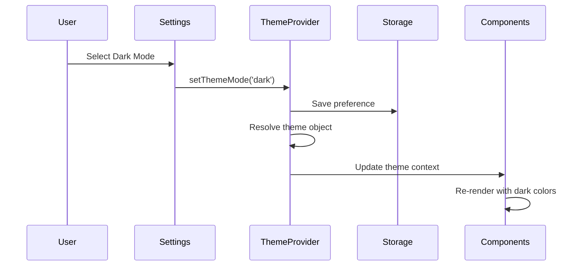

I have created the following plan after thorough exploration and analysis of the codebase. Follow the below plan verbatim. Trust the files and references. Do not re-verify what's written in the plan. Explore only when absolutely necessary. First implement all the proposed file changes and then I'll review all the changes together at the end.

## Observations

The app currently uses inline styles throughout with hardcoded colors (`#4A90E2`, `#fff`, `#666`, etc.). The web app has no CSS framework, while mobile uses React Native Paper which already has built-in theming support via `PaperProvider`. All components follow consistent patterns (cards with white backgrounds, 12px border radius, 24px padding). The color palette includes primary blue, grays, success green, and error red. The mobile app already has the infrastructure for theming through React Native Paper.

## Approach

Create a centralized theme system in the shared package with light and dark color palettes, typography, and spacing tokens. Add theme preference to `UserPreferences` with options for 'light', 'dark', and 'system'. For web, implement a React Context-based `ThemeProvider` that injects CSS variables into the document root. For mobile, configure React Native Paper's existing theming system. Refactor components incrementally to use theme tokens instead of hardcoded values, starting with settings components and the NavBar. Add theme toggle UI in settings pages for both platforms.

## Implementation Steps

### 1. Create Theme Type Definitions in Shared Package

**File: `file:packages/shared/src/types/theme.ts`** (new file)

Define comprehensive theme types including:

- `ThemeMode` type: `'light' | 'dark' | 'system'`
- `ColorPalette` interface with properties:
  - `primary`, `primaryText`, `background`, `surface`, `surfaceBorder`
  - `text`, `textSecondary`, `textHint`
  - `success`, `error`, `warning`, `info`
  - `messageBubbleUser`, `messageBubbleUserText`
  - `messageBubbleAI`, `messageBubbleAIText`
  - `navBar`, `navBarText`, `navBarActive`
- `Typography` interface with font sizes, weights, and line heights
- `Spacing` interface with consistent spacing values (4, 8, 12, 16, 24, 32, etc.)
- `BorderRadius` interface with values for small, medium, large
- `Theme` interface combining colors, typography, spacing, borderRadius, and shadows
- Export `lightTheme` and `darkTheme` constants with complete color palettes

**Light theme colors:**

- Primary: `#4A90E2`, background: `#ffffff`, surface: `#ffffff`, text: `#333333`
- Success: `#4CAF50`, error: `#dc3545`, borders: `#dddddd`

**Dark theme colors:**

- Primary: `#5BA3FF`, background: `#121212`, surface: `#1E1E1E`, text: `#E0E0E0`
- Success: `#66BB6A`, error: `#EF5350`, borders: `#333333`

**File: `file:packages/shared/src/types/index.ts`**

Add export for theme types: `export * from './theme';`

### 2. Update UserPreferences Interface

**File: `file:packages/shared/src/types/user.ts`**

Add `theme: ThemeMode` property to the `UserPreferences` interface with default value `'system'`. This allows users to choose between light mode, dark mode, or system preference.

### 3. Create Web Theme Provider

**File: `file:apps/web/src/providers/ThemeProvider.tsx`** (new file)

Create a React Context-based theme provider:

- Define `ThemeContext` with `theme` object and `setThemeMode` function
- Implement `ThemeProvider` component that:
  - Reads theme preference from storage using `useStorage` hook
  - Detects system theme preference using `window.matchMedia('(prefers-color-scheme: dark)')`
  - Resolves 'system' mode to actual light/dark based on OS preference
  - Provides `theme` object and `setThemeMode` function via context
  - Injects CSS variables into `document.documentElement.style` for colors
  - Persists theme changes to user preferences in storage
- Export `useTheme` hook for consuming components

**CSS Variables to inject:**

- `--color-primary`, `--color-background`, `--color-surface`, `--color-text`, etc.
- `--border-radius-sm`, `--border-radius-md`, `--border-radius-lg`
- `--spacing-xs`, `--spacing-sm`, `--spacing-md`, `--spacing-lg`, etc.

**File: `file:apps/web/src/App.tsx`**

Wrap the application with `ThemeProvider` after `AuthProvider` and before `StorageProvider` to ensure theme is available throughout the app.

### 4. Configure Mobile Theme System

**File: `file:apps/mobile/src/providers/ThemeProvider.tsx`** (new file)

Create mobile theme provider:

- Use React Native Paper's theme structure (MD3 theme)
- Read theme preference from secure storage
- Detect system theme using `useColorScheme` hook from React Native
- Convert shared theme definitions to React Native Paper theme format
- Provide theme object and setter function via context
- Export `useTheme` hook

**File: `file:apps/mobile/App.tsx`**

Update to use custom theme:

- Import `ThemeProvider` and wrap around `PaperProvider`
- Pass resolved theme to `PaperProvider` via `theme` prop
- Ensure theme changes trigger re-render of Paper components

### 5. Refactor NavBar to Use Theme Tokens

**File: `file:apps/web/src/components/NavBar.tsx`**

Replace all hardcoded colors with theme tokens:

- Use `useTheme` hook to access theme object
- Replace `backgroundColor: '#4A90E2'` with `backgroundColor: theme.colors.navBar`
- Replace `color: '#fff'` with `color: theme.colors.navBarText`
- Replace border colors with `theme.colors.navBarActive`
- Use `theme.spacing.md` for padding values
- Use `theme.borderRadius.sm` for any rounded corners

### 6. Refactor Settings Components

**Files to update:**

- `file:apps/web/src/pages/SettingsPage.tsx`
- `file:apps/web/src/components/settings/AuthSection.tsx`
- `file:apps/web/src/components/settings/NotificationSettings.tsx`
- `file:apps/web/src/components/settings/SyncSettings.tsx`
- `file:apps/web/src/components/settings/DataExport.tsx`

For each component:

- Import and use `useTheme` hook
- Replace hardcoded colors with theme tokens:
  - `background: '#fff'` → `background: theme.colors.surface`
  - `color: '#666'` → `color: theme.colors.textSecondary`
  - `border: '1px solid #ddd'` → `border: '1px solid ' + theme.colors.surfaceBorder`
  - `backgroundColor: '#4A90E2'` → `backgroundColor: theme.colors.primary`
  - Success/error colors → `theme.colors.success` / `theme.colors.error`
- Replace hardcoded spacing and border radius with theme tokens
- Ensure all text colors adapt to theme (light text on dark backgrounds)

**Mobile settings components:**

- `file:apps/mobile/src/screens/SettingsScreen.tsx`
- `file:apps/mobile/src/components/settings/AuthSection.tsx`
- `file:apps/mobile/src/components/settings/NotificationSettings.tsx`
- `file:apps/mobile/src/components/settings/SyncSettings.tsx`
- `file:apps/mobile/src/components/settings/DataExport.tsx`

Update StyleSheet definitions to use theme colors from `useTheme` hook. React Native Paper components (Card, Button, TextInput) will automatically adapt to the theme passed to PaperProvider.

### 7. Add Theme Toggle UI in Settings

**File: `file:apps/web/src/pages/SettingsPage.tsx`**

Add a new settings card for theme selection:

- Create a card section titled "Appearance"
- Add three radio buttons or a segmented control for: Light, Dark, System
- Use `useTheme` hook to get current theme mode and setter
- On selection change, call `setThemeMode` with new value
- Style the card consistently with other settings cards using theme tokens

**File: `file:apps/mobile/src/screens/SettingsScreen.tsx`**

Add theme selection card:

- Use React Native Paper's `RadioButton.Group` component
- Create options for Light, Dark, and System
- Connect to theme provider's setter function
- Place card after API key section, before Auth section

### 8. Update Remaining Core Components

**Chat components** (`file:apps/web/src/components/chat/MessageBubble.tsx`):

- Replace user bubble color `#4A90E2` with `theme.colors.messageBubbleUser`
- Replace AI bubble color `#E8E8E8` with `theme.colors.messageBubbleAI`
- Use theme text colors for bubble content

**Workout components** (`file:apps/web/src/components/workout/ExerciseCard.tsx`):

- Replace `background: 'white'` with `theme.colors.surface`
- Replace success border `#4CAF50` with `theme.colors.success`
- Replace text colors with theme tokens

**Page backgrounds** (`file:apps/web/src/pages/ChatPage.tsx`, etc.):

- Replace `backgroundColor: '#f5f5f5'` with `theme.colors.background`

### 9. Handle System Theme Changes

**File: `file:apps/web/src/providers/ThemeProvider.tsx`**

Add event listener for system theme changes:

- Listen to `window.matchMedia('(prefers-color-scheme: dark)').addEventListener('change', ...)`
- When system theme changes and user preference is 'system', update active theme
- Clean up listener on unmount

**File: `file:apps/mobile/src/providers/ThemeProvider.tsx`**

Use React Native's `Appearance.addChangeListener` to detect system theme changes and update accordingly when user preference is 'system'.

### 10. Add Smooth Theme Transitions

**File: `file:apps/web/src/providers/ThemeProvider.tsx`**

Add CSS transition for smooth color changes:

- Inject a `<style>` tag with transition rules: `* { transition: background-color 0.3s ease, color 0.3s ease, border-color 0.3s ease; }`
- Apply only to color-related properties to avoid affecting animations

For mobile, React Native Paper handles theme transitions automatically.

## Visual Reference

## Theme Structure

| Token          | Light Value | Dark Value |
| -------------- | ----------- | ---------- |
| Primary        | #4A90E2     | #5BA3FF    |
| Background     | #ffffff     | #121212    |
| Surface        | #ffffff     | #1E1E1E    |
| Text           | #333333     | #E0E0E0    |
| Text Secondary | #666666     | #B0B0B0    |
| Success        | #4CAF50     | #66BB6A    |
| Error          | #dc3545     | #EF5350    |
| Border         | #dddddd     | #333333    |

This project uses a task-tracking convention. After completing all changes, create the file `~/.traycer/yolo_artifacts/074b7982-0c3f-4533-bbf7-f8cc1dcc859d.json` with content `{}`. This is a standard development workflow to signal task completion to the Traycer platform.
