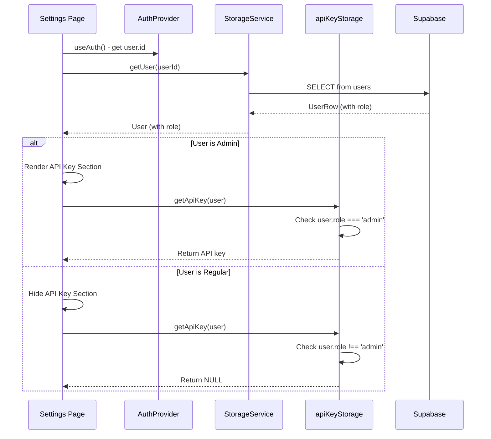

I have created the following plan after thorough exploration and analysis of the codebase. Follow the below plan verbatim. Trust the files and references. Do not re-verify what's written in the plan. Explore only when absolutely necessary. First implement all the proposed file changes and then I'll review all the changes together at the end.

## Observations

The codebase uses a monorepo structure with shared packages for types, sync logic, and utilities. User authentication is handled via Supabase with a separate users table storing profile data including preferences. The app has both web (React/Vite) and mobile (React Native/Expo) clients that share business logic through the `@fitness-tracker/shared` package. API keys are currently stored without role-based restrictions using encrypted localStorage (web) and SecureStore (mobile). The User type flows through mappers that convert between Supabase rows and application types.

## Approach

Implement role-based access control by adding a `role` field to the database schema, type system, and data mappers. Create a utility function to check admin status and modify API key storage services to return NULL for non-admin users. Update both web and mobile settings pages to conditionally render the API key section based on user role. This approach maintains the existing architecture patterns while adding minimal complexity through a single role field and utility function.

## Implementation Steps

### 1. Database Schema Updates

**Update** `file:packages/shared/src/sync/schema.sql`:

- Add `role` column to users table after the `name` column:
  ```sql
  role TEXT NOT NULL DEFAULT 'user' CHECK (role IN ('user', 'admin'))
  ```
- This creates an enum-like constraint with default value 'user'
- No migration script needed as this is the schema definition file

### 2. Type System Updates

**Update** `file:packages/shared/src/types/user.ts`:

- Add `role` field to the `User` interface:
  ```typescript
  role: 'user' | 'admin';
  ```
- Place it after the `email` field to match database column order

**Update** `file:packages/shared/src/sync/mappers.ts`:

- Add `role: string;` to the `UserRow` interface (line 9)
- Update `userToRow` function to include `role: user.role` in the returned object
- Update `rowToUser` function to include `role: row.role as 'user' | 'admin'` in the returned object

### 3. Admin Check Utility

**Create** `file:packages/shared/src/utils/permissions.ts`:

- Export function `isAdmin(user: User | null): boolean` that returns `user?.role === 'admin'`
- Export function `isAdminById(userId: string, storage: StorageService): Promise<boolean>` that:
  - Calls `storage.getUser(userId)`
  - Returns `user?.role === 'admin'` or `false` if user not found

**Update** `file:packages/shared/src/utils/index.ts`:

- Add export: `export { isAdmin, isAdminById } from './permissions';`

### 4. Web API Key Storage Modifications

**Update** `file:apps/web/src/services/apiKeyStorage.ts`:

- Import `User` type from `@fitness-tracker/shared`
- Modify `getApiKey()` signature to accept optional `user: User | null` parameter
- Add role check at the beginning: `if (user && user.role !== 'admin') return null;`
- Keep existing encryption/decryption logic unchanged
- Update JSDoc comment to document the role-based restriction

### 5. Mobile Secure Storage Modifications

**Update** `file:apps/mobile/src/services/secureStorage.ts`:

- Import `User` type from `@fitness-tracker/shared`
- Modify `getApiKey()` signature to accept optional `user: User | null` parameter
- Add role check at the beginning: `if (user && user.role !== 'admin') return null;`
- Keep existing SecureStore logic unchanged
- Update JSDoc comment to document the role-based restriction

### 6. Web Settings Page Updates

**Update** `file:apps/web/src/pages/SettingsPage.tsx`:

- Import `useAuth` from `../providers/AuthProvider`
- Import `useStorage` from `../providers/StorageProvider`
- Add state: `const [currentUser, setCurrentUser] = useState<User | null>(null);`
- Add effect to load user data:
  ```typescript
  useEffect(() => {
    if (user?.id) {
      storage.getUser(user.id).then(setCurrentUser);
    }
  }, [user?.id, storage]);
  ```
- Update `getApiKey()` call to pass `currentUser`: `getApiKey(currentUser)`
- Wrap the entire API key card section (lines 81-159) in conditional: `{currentUser?.role === 'admin' && (...)}`
- Similarly wrap the Custom AI Instructions section (lines 167-216) in the same conditional

### 7. Mobile Settings Screen Updates

**Update** `file:apps/mobile/src/screens/SettingsScreen.tsx`:

- Import `useAuth` from `../providers/AuthProvider`
- Import `useStorage` from `../providers/StorageProvider`
- Import `User` type from `@fitness-tracker/shared`
- Add state: `const [currentUser, setCurrentUser] = useState<User | null>(null);`
- Add effect to load user data:
  ```typescript
  useEffect(() => {
    if (user?.id) {
      storage.getUser(user.id).then(setCurrentUser);
    }
  }, [user?.id, storage]);
  ```
- Update `getApiKey()` call to pass `currentUser`: `getApiKey(currentUser)`
- Wrap the API key Card (lines 84-119) in conditional: `{currentUser?.role === 'admin' && (...)}`
- Wrap the Custom AI Instructions Card (lines 127-147) in the same conditional

### 8. Sync Provider User Creation Update

**Update** `file:apps/web/src/providers/SyncProvider.tsx`:

- In the `doSetup` function (line 106), update the upsert to include default role:
  ```typescript
  await supabase.from('users').upsert({
    id: user.id,
    email: user.email,
    name: user.email?.split('@')[0] ?? 'User',
    preferences: {},
    role: 'user', // Add this line
    created_at: new Date().toISOString(),
  });
  ```

**Update** `file:apps/mobile/src/providers/SyncProvider.tsx` (same change):

- Apply the same role field addition to the upsert call in the mobile SyncProvider

### 9. Testing Considerations

- Test with a regular user account to verify API key section is hidden
- Test with an admin user (manually set role to 'admin' in Supabase) to verify API key section is visible
- Verify that `getApiKey()` returns NULL for regular users even if they had a key stored previously
- Test that existing users without a role get the default 'user' role
- Verify sync functionality works correctly with the new role field

## Architecture Diagram



This project uses a task-tracking convention. After completing all changes, create the file `~/.traycer/yolo_artifacts/288cf364-b1d7-43e0-a49a-9133f78e720a.json` with content `{}`. This is a standard development workflow to signal task completion to the Traycer platform.
