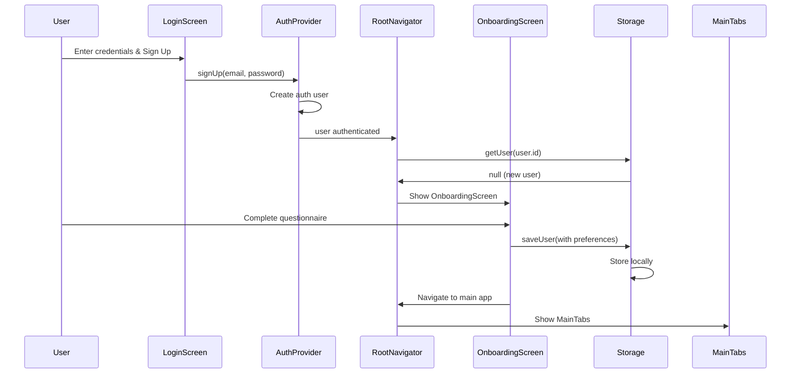

I have created the following plan after thorough exploration and analysis of the codebase. Follow the below plan verbatim. Trust the files and references. Do not re-verify what's written in the plan. Explore only when absolutely necessary. First implement all the proposed file changes and then I'll review all the changes together at the end.

## Observations

The codebase has a working authentication flow with `LoginScreen` already implemented. The `UserPreferences` interface currently has only 4 basic fields (weightUnit, restTimerDefault, voiceInputEnabled, cloudSyncEnabled). The `buildSystemPrompt` function in `contextBuilder.ts` uses preferences but only references `weightUnit`. User data is stored via `SqliteStorageService.saveUser()` which serializes preferences as JSON. There's no existing onboarding flow or tracking mechanism.

## Approach

Extend the `UserPreferences` type to include workout-specific fields (goals, injuries, frequency, experience, equipment). Create a multi-step `OnboardingScreen` using react-native-paper components with custom step navigation (no external stepper library needed). Add onboarding tracking to `UserPreferences` to determine if questionnaire should be shown. Integrate the screen into the navigation stack after successful signup/first login. Update `buildSystemPrompt` to incorporate new preference fields into Claude's system prompt for personalized coaching.

## Implementation Steps

### 1. Extend UserPreferences Interface

**File:** `file:packages/shared/src/types/user.ts`

Add new fields to the `UserPreferences` interface:

- `workoutGoals`: string array (e.g., ['strength', 'hypertrophy', 'endurance', 'weight_loss'])
- `injuries`: string (free text describing any injuries or limitations)
- `workoutFrequency`: number (days per week)
- `experienceLevel`: 'beginner' | 'intermediate' | 'advanced'
- `availableEquipment`: string array (e.g., ['barbell', 'dumbbells', 'machines', 'bodyweight'])
- `hasCompletedOnboarding`: boolean (tracks if questionnaire was completed)

### 2. Create OnboardingScreen Component

**File:** `file:apps/mobile/src/screens/OnboardingScreen.tsx` (new file)

Create a multi-step questionnaire screen with the following structure:

**Step Management:**

- Use local state to track current step (0-4)
- Implement `handleNext`, `handleBack`, `handleSkip` functions
- Store form data in local state object

**Step 1: Workout Goals**

- Use `Chip` components in multi-select mode for goal selection
- Options: Strength, Muscle Building, Weight Loss, Endurance, General Fitness, Athletic Performance
- Allow multiple selections

**Step 2: Experience Level**

- Use `RadioButton.Group` with three options
- Beginner: "New to working out or returning after a long break"
- Intermediate: "1-3 years of consistent training"
- Advanced: "3+ years of structured training"

**Step 3: Workout Frequency**

- Use `Slider` or `SegmentedButtons` for selecting days per week (1-7)
- Display selected value prominently

**Step 4: Available Equipment**

- Use `Chip` components in multi-select mode
- Options: Barbell, Dumbbells, Kettlebells, Resistance Bands, Machines, Pull-up Bar, Bodyweight Only, Full Gym Access
- Allow multiple selections

**Step 5: Injuries & Limitations**

- Use `TextInput` with multiline mode
- Placeholder: "Describe any injuries, pain, or movement limitations (e.g., lower back pain, shoulder mobility issues)"
- Make this optional

**UI Components:**

- Use `ProgressBar` at top showing completion (currentStep / totalSteps)
- Use `Card` component to wrap each step's content
- Bottom navigation with `Button` components: "Back", "Skip", "Next"/"Finish"
- Style consistently with existing screens (reference `file:apps/mobile/src/screens/SettingsScreen.tsx`)

**Data Handling:**

- On "Finish", construct updated `UserPreferences` object with all new fields
- Retrieve current user via `useAuth` hook
- Get storage service via `useStorage` hook
- Fetch existing user data with `storage.getUser(user.id)`
- Merge new preferences with existing ones
- Call `storage.saveUser()` with updated user object
- Set `hasCompletedOnboarding: true`
- Navigate to main app

**Skip Functionality:**

- Allow users to skip with a "Skip for now" button
- Still set `hasCompletedOnboarding: true` but with default/empty values
- Navigate to main app

### 3. Update Navigation Flow

**File:** `file:apps/mobile/src/navigation/RootNavigator.tsx`

Modify the stack navigator to conditionally show onboarding:

**Add Onboarding Check:**

- Import `useStorage` hook
- Import `OnboardingScreen`
- Add state to track if user needs onboarding
- In a `useEffect`, when `user` exists, fetch user data via `storage.getUser(user.id)`
- Check if `user.preferences.hasCompletedOnboarding === false`
- Show loading indicator while checking

**Update Stack Navigator:**

- Add three possible states: unauthenticated (LoginScreen), needs onboarding (OnboardingScreen), authenticated (MainTabs)
- Structure:
  ```
  if (!user) -> LoginScreen
  else if (!hasCompletedOnboarding) -> OnboardingScreen
  else -> MainTabs
  ```

**Handle New Signups:**

- When a user signs up for the first time, they won't have a user record yet
- The `SyncProvider` will create one via `remapLocalUser`
- Need to ensure new users get default preferences with `hasCompletedOnboarding: false`

### 4. Initialize New Users with Default Preferences

**File:** `file:packages/shared/src/sync/syncEngine.ts`

Update the `remapLocalUser` method:

**Current Behavior:**

- Checks if user exists with `localStorage.getUser(oldId)`
- If exists, re-saves with new ID

**New Behavior:**

- If user doesn't exist at all (new signup), create a default user object
- Default user should have:
  - `id`: newId (from auth)
  - `email`: fetch from Supabase auth session
  - `name`: extract from email or use "User"
  - `createdAt`: current ISO timestamp
  - `preferences`: default preferences object with `hasCompletedOnboarding: false`
- Save this default user via `localStorage.saveUser()`

**Alternative Approach:**

- Handle this in `SyncProvider` instead of `syncEngine`
- After checking `existing = await storage.getUser(user.id)`, if null, create and save default user
- This keeps sync engine focused on data migration

### 5. Update Context Builder for Personalized Prompts

**File:** `file:packages/shared/src/api/contextBuilder.ts`

Enhance the `buildSystemPrompt` function to incorporate new preference fields:

**Add Workout Goals Section:**

- If `preferences.workoutGoals` exists and has items, add:
  - "User's workout goals: [comma-separated goals]"

**Add Experience Level:**

- If `preferences.experienceLevel` exists, add:
  - "Experience level: [level]"
  - Include context-specific guidance (e.g., for beginners: "Focus on form and progressive overload basics")

**Add Workout Frequency:**

- If `preferences.workoutFrequency` exists, add:
  - "Preferred workout frequency: [X] days per week"
  - "Design programs that fit this schedule"

**Add Equipment Constraints:**

- If `preferences.availableEquipment` exists and has items, add:
  - "Available equipment: [comma-separated equipment]"
  - "Only suggest exercises using this equipment"

**Add Injuries/Limitations:**

- If `preferences.injuries` exists and is non-empty, add:
  - "Important: User has the following injuries/limitations: [injuries]"
  - "Avoid exercises that may aggravate these conditions and suggest modifications when needed"

**Placement:**

- Add these sections after the custom system prompt but before goals
- Order: Custom prompt → Experience → Goals → Frequency → Equipment → Injuries → Recent history

### 6. Add Settings UI for Preference Management

**File:** `file:apps/mobile/src/screens/SettingsScreen.tsx`

Add a new card section for workout preferences:

**Card Title:** "Workout Preferences"

**Content:**

- Display current preferences in read-only format or with edit capability
- Add "Update Preferences" button that navigates to `OnboardingScreen` with edit mode
- Alternatively, create inline editors for each preference field

**Navigation:**

- If using navigation approach, pass a prop to `OnboardingScreen` indicating it's in edit mode
- In edit mode, pre-populate form with existing values
- Change "Finish" button to "Save Changes"

### 7. Handle Edge Cases

**First-time User Flow:**

- User signs up → LoginScreen → Auth succeeds → SyncProvider creates default user → RootNavigator detects `hasCompletedOnboarding: false` → Shows OnboardingScreen → User completes → Navigate to MainTabs

**Existing User Flow:**

- User signs in → LoginScreen → Auth succeeds → SyncProvider syncs existing user → RootNavigator detects `hasCompletedOnboarding: true` → Shows MainTabs directly

**Skip Flow:**

- User skips onboarding → Set `hasCompletedOnboarding: true` with empty/default values → Can update later in Settings

**Offline Behavior:**

- Onboarding data is saved locally first via `storage.saveUser()`
- When sync runs, it will push to Supabase
- User can complete onboarding offline

### 8. Update Database Schema (if needed)

**File:** `file:apps/mobile/src/storage/migrations.ts`

Check if the `users` table schema needs updating:

- The `preferences` column is already stored as JSON text
- No schema migration needed since we're just adding fields to the JSON object
- Existing users will have old preference structure, new users will have extended structure
- Handle gracefully in code by checking field existence

## Visual Flow Diagram



## Onboarding Screen Layout

```
┌─────────────────────────────────┐
│  Fitness Tracker                │
│  ━━━━━━━━━━━━━━━━━━━━━━━━━━━━  │ ← ProgressBar (3/5)
│                                 │
│  ┌───────────────────────────┐ │
│  │ What are your goals?      │ │
│  │                           │ │
│  │ ○ Strength                │ │
│  │ ○ Muscle Building         │ │
│  │ ○ Weight Loss             │ │
│  │ ○ Endurance               │ │
│  │ ○ General Fitness         │ │
│  └───────────────────────────┘ │
│                                 │
│  [Back]  [Skip]  [Next]         │
└─────────────────────────────────┘
```

This project uses a task-tracking convention. After completing all changes, create the file `~/.traycer/yolo_artifacts/9f3c924d-145f-4d07-8534-cae4a4897315.json` with content `{}`. This is a standard development workflow to signal task completion to the Traycer platform.
