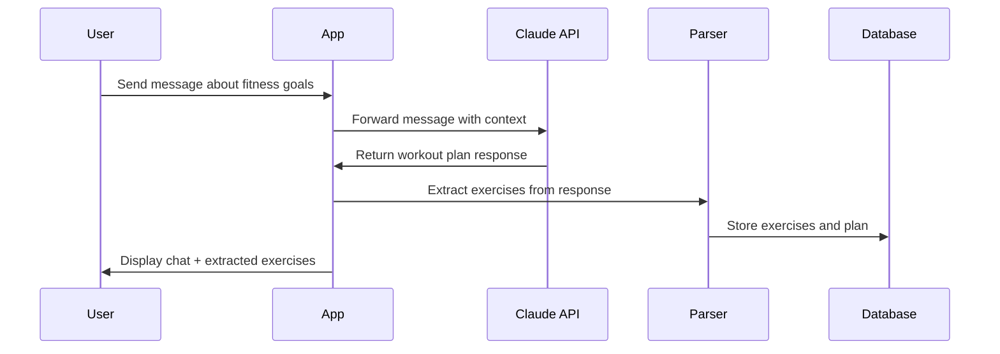

# Product Requirements - AI Fitness Tracker

# AI Fitness Tracker - Product Requirements Document

## Overview

An AI-powered fitness tracking application that integrates with Claude AI to provide personalized workout planning, intelligent exercise tracking, and data-driven progress insights. The app combines conversational AI with structured workout logging to create a seamless fitness journey experience.

## Target Platforms

- **Mobile**: iOS and Android (React Native)
- **Web**: Browser-based application (React)
- **Shared Codebase**: Maximum code reuse between platforms

## Core Value Proposition

1. **Conversational Workout Planning**: Natural dialogue with Claude AI to create and refine personalized workout plans
2. **Intelligent Data Extraction**: Automatic parsing of workout plans into trackable exercises
3. **Effortless Logging**: Voice-enabled quick logging during workouts
4. **Smart Recommendations**: AI-powered weight and progression suggestions based on historical performance
5. **Continuous Adaptation**: Weekly plan updates that evolve with your progress

## User Stories

### Primary User Stories

**US-1: Chat-Based Workout Planning**

- As a user, I want to chat with Claude about my fitness goals
- So that I can receive a personalized workout plan tailored to my needs
- Acceptance: User can send messages, receive AI responses, and maintain conversation context

**US-2: Automatic Exercise Extraction**

- As a user, I want the app to automatically extract exercises from Claude's workout plan
- So that I don't have to manually create tracking entries
- Acceptance: Exercises, sets, reps, and suggested weights are parsed and added to my tracker

**US-3: Quick Voice Logging**

- As a user, I want to log my workout data using voice commands during exercise
- So that I can track without interrupting my workout flow
- Acceptance: Voice input like "3 sets of 10 reps at 135 pounds" is correctly parsed and logged

**US-4: Historical Progress Tracking**

- As a user, I want to view my workout history and progress over time
- So that I can see my improvements and stay motivated
- Acceptance: Charts and tables show exercise performance trends

**US-5: AI Weight Suggestions**

- As a user, I want Claude to suggest appropriate weights based on my history
- So that I can progressively overload safely and effectively
- Acceptance: Weight recommendations consider recent performance and progression patterns

**US-6: Weekly Plan Updates**

- As a user, I want to receive updated workout plans weekly
- So that my training adapts to my progress
- Acceptance: Reminders prompt plan review, and Claude generates updated plans based on logged data

### Secondary User Stories

**US-7: Offline Capability**

- As a user, I want to access my workout data offline
- So that I can train anywhere without internet dependency
- Acceptance: Local storage enables viewing and logging without connectivity

**US-8: Cloud Backup**

- As a user, I want to optionally backup my data to the cloud
- So that I don't lose my progress if I change devices
- Acceptance: Manual or automatic sync to cloud storage with conflict resolution

## Feature Breakdown

### 1. Chat Interface



**Features:**

- Full-screen chat interface with message history
- Context-aware conversations (maintains workout history context)
- Markdown rendering for formatted workout plans
- Exercise extraction indicator (shows what was auto-detected)
- Manual exercise addition for missed items

### 2. Exercise Tracker

**Features:**

- Exercise library (auto-populated from Claude conversations)
- Current workout view (today's planned exercises)
- Quick log interface (sets, reps, weight)
- Rest timer between sets
- Exercise notes and form cues
- Completion status tracking

### 3. Voice Input System

**Features:**

- Push-to-talk or continuous listening modes
- Natural language parsing for workout data
- Confirmation UI before saving
- Error correction interface
- Support for common phrases:
  - "3 sets of 10 reps at 135 pounds"
  - "Bench press, 3 by 10 at 135"
  - "Just did 5 reps at 225"

### 4. Progress Dashboard

**Features:**

- Weekly/monthly/all-time views
- Exercise-specific progress charts
- Volume tracking (total weight × reps)
- Personal records (PRs) highlights
- Consistency metrics (workout frequency)
- Body metrics tracking (optional: weight, measurements)

### 5. Data Sync & Storage

**Features:**

- Local-first architecture (SQLite/AsyncStorage)
- Optional cloud backup (Firebase/Supabase)
- Conflict resolution for multi-device usage
- Export data (JSON/CSV)
- Import historical data

## UI Wireframes

### Main Chat Interface

```wireframe
<!DOCTYPE html>
<html>
<head>
<style>
* { margin: 0; padding: 0; box-sizing: border-box; }
body { font-family: -apple-system, BlinkMacSystemFont, 'Segoe UI', sans-serif; background: #f5f5f5; }
.container { max-width: 400px; margin: 0 auto; background: white; height: 100vh; display: flex; flex-direction: column; }
.header { background: #4A90E2; color: white; padding: 16px; font-weight: 600; font-size: 18px; }
.chat-area { flex: 1; overflow-y: auto; padding: 16px; }
.message { margin-bottom: 16px; }
.message.user { text-align: right; }
.message-bubble { display: inline-block; padding: 12px 16px; border-radius: 16px; max-width: 80%; }
.message.user .message-bubble { background: #4A90E2; color: white; }
.message.ai .message-bubble { background: #E8E8E8; color: #333; }
.extracted-exercises { background: #FFF3CD; border: 1px solid #FFE69C; border-radius: 8px; padding: 12px; margin-top: 8px; }
.extracted-exercises h4 { font-size: 14px; margin-bottom: 8px; color: #856404; }
.exercise-item { background: white; padding: 8px; margin: 4px 0; border-radius: 4px; font-size: 13px; }
.input-area { border-top: 1px solid #ddd; padding: 12px; display: flex; gap: 8px; }
.input-area input { flex: 1; padding: 12px; border: 1px solid #ddd; border-radius: 20px; font-size: 16px; }
.voice-btn { background: #4A90E2; color: white; border: none; padding: 12px 16px; border-radius: 20px; font-weight: 600; }
.send-btn { background: #4A90E2; color: white; border: none; padding: 12px 20px; border-radius: 20px; font-weight: 600; }
.nav-bar { display: flex; border-top: 1px solid #ddd; }
.nav-item { flex: 1; padding: 12px; text-align: center; background: white; border: none; font-size: 14px; }
.nav-item.active { color: #4A90E2; font-weight: 600; }
</style>
</head>
<body>
<div class="container">
  <div class="header">AI Fitness Coach</div>

  <div class="chat-area">
    <div class="message user">
      <div class="message-bubble">I want to build muscle and strength. I can train 4 days a week.</div>
    </div>

    <div class="message ai">
      <div class="message-bubble">
        Great! I'll create a 4-day upper/lower split for you. Here's your Week 1 plan:
        <br><br>
        <strong>Day 1 - Upper Body</strong><br>
        • Bench Press: 4 sets × 8 reps<br>
        • Barbell Rows: 4 sets × 8 reps<br>
        • Overhead Press: 3 sets × 10 reps<br>
        • Pull-ups: 3 sets × max reps
      </div>

      <div class="extracted-exercises">
        <h4>✓ Extracted 4 exercises</h4>
        <div class="exercise-item" data-element-id="exercise-1">Bench Press - 4×8</div>
        <div class="exercise-item" data-element-id="exercise-2">Barbell Rows - 4×8</div>
        <div class="exercise-item" data-element-id="exercise-3">Overhead Press - 3×10</div>
        <div class="exercise-item" data-element-id="exercise-4">Pull-ups - 3×max</div>
      </div>
    </div>
  </div>

  <div class="input-area">
    <button class="voice-btn" data-element-id="voice-input-btn">🎤</button>
    <input type="text" placeholder="Ask about your workout..." data-element-id="chat-input">
    <button class="send-btn" data-element-id="send-btn">Send</button>
  </div>

  <div class="nav-bar">
    <button class="nav-item active" data-element-id="nav-chat">Chat</button>
    <button class="nav-item" data-element-id="nav-workout">Workout</button>
    <button class="nav-item" data-element-id="nav-progress">Progress</button>
    <button class="nav-item" data-element-id="nav-profile">Profile</button>
  </div>
</div>
</body>
</html>
```

### Workout Logging Screen

```wireframe
<!DOCTYPE html>
<html>
<head>
<style>
* { margin: 0; padding: 0; box-sizing: border-box; }
body { font-family: -apple-system, BlinkMacSystemFont, 'Segoe UI', sans-serif; background: #f5f5f5; }
.container { max-width: 400px; margin: 0 auto; background: white; min-height: 100vh; }
.header { background: #4A90E2; color: white; padding: 16px; }
.header h1 { font-size: 18px; font-weight: 600; }
.header p { font-size: 14px; opacity: 0.9; margin-top: 4px; }
.content { padding: 16px; }
.exercise-card { background: white; border: 2px solid #E8E8E8; border-radius: 12px; padding: 16px; margin-bottom: 16px; }
.exercise-card.completed { border-color: #4CAF50; background: #F1F8F4; }
.exercise-header { display: flex; justify-content: space-between; align-items: center; margin-bottom: 12px; }
.exercise-name { font-size: 18px; font-weight: 600; }
.suggested-weight { font-size: 14px; color: #666; background: #FFF3CD; padding: 4px 8px; border-radius: 4px; }
.sets-container { margin-top: 12px; }
.set-row { display: flex; gap: 8px; margin-bottom: 8px; align-items: center; }
.set-label { width: 60px; font-size: 14px; color: #666; }
.input-group { display: flex; gap: 8px; flex: 1; }
.input-field { flex: 1; padding: 10px; border: 1px solid #ddd; border-radius: 8px; text-align: center; font-size: 16px; }
.check-btn { background: #4CAF50; color: white; border: none; padding: 10px; border-radius: 8px; width: 40px; }
.check-btn.unchecked { background: #E8E8E8; }
.voice-log-btn { background: #4A90E2; color: white; border: none; padding: 16px; border-radius: 12px; width: 100%; font-size: 16px; font-weight: 600; margin-top: 16px; }
.timer { background: #F8F9FA; padding: 12px; border-radius: 8px; text-align: center; margin-top: 16px; }
.timer-display { font-size: 32px; font-weight: 600; color: #4A90E2; }
.timer-label { font-size: 14px; color: #666; margin-top: 4px; }
</style>
</head>
<body>
<div class="container">
  <div class="header">
    <h1>Upper Body - Day 1</h1>
    <p>Monday, Feb 7, 2026</p>
  </div>

  <div class="content">
    <div class="exercise-card completed">
      <div class="exercise-header">
        <span class="exercise-name">Bench Press</span>
        <span class="suggested-weight">Suggested: 135 lbs</span>
      </div>
      <div class="sets-container">
        <div class="set-row">
          <span class="set-label">Set 1</span>
          <div class="input-group">
            <input type="number" class="input-field" placeholder="Reps" value="8" data-element-id="bench-set1-reps">
            <input type="number" class="input-field" placeholder="Weight" value="135" data-element-id="bench-set1-weight">
          </div>
          <button class="check-btn" data-element-id="bench-set1-check">✓</button>
        </div>
        <div class="set-row">
          <span class="set-label">Set 2</span>
          <div class="input-group">
            <input type="number" class="input-field" placeholder="Reps" value="8" data-element-id="bench-set2-reps">
            <input type="number" class="input-field" placeholder="Weight" value="135" data-element-id="bench-set2-weight">
          </div>
          <button class="check-btn" data-element-id="bench-set2-check">✓</button>
        </div>
        <div class="set-row">
          <span class="set-label">Set 3</span>
          <div class="input-group">
            <input type="number" class="input-field" placeholder="Reps" value="8" data-element-id="bench-set3-reps">
            <input type="number" class="input-field" placeholder="Weight" value="135" data-element-id="bench-set3-weight">
          </div>
          <button class="check-btn" data-element-id="bench-set3-check">✓</button>
        </div>
        <div class="set-row">
          <span class="set-label">Set 4</span>
          <div class="input-group">
            <input type="number" class="input-field" placeholder="Reps" data-element-id="bench-set4-reps">
            <input type="number" class="input-field" placeholder="Weight" data-element-id="bench-set4-weight">
          </div>
          <button class="check-btn unchecked" data-element-id="bench-set4-check">○</button>
        </div>
      </div>
    </div>

    <div class="exercise-card">
      <div class="exercise-header">
        <span class="exercise-name">Barbell Rows</span>
        <span class="suggested-weight">Suggested: 115 lbs</span>
      </div>
      <div class="sets-container">
        <div class="set-row">
          <span class="set-label">Set 1</span>
          <div class="input-group">
            <input type="number" class="input-field" placeholder="Reps" data-element-id="row-set1-reps">
            <input type="number" class="input-field" placeholder="Weight" data-element-id="row-set1-weight">
          </div>
          <button class="check-btn unchecked" data-element-id="row-set1-check">○</button>
        </div>
      </div>
    </div>

    <button class="voice-log-btn" data-element-id="voice-log-btn">🎤 Voice Log Set</button>

    <div class="timer">
      <div class="timer-display">2:30</div>
      <div class="timer-label">Rest Timer</div>
    </div>
  </div>
</div>
</body>
</html>
```

### Progress Dashboard

```wireframe
<!DOCTYPE html>
<html>
<head>
<style>
* { margin: 0; padding: 0; box-sizing: border-box; }
body { font-family: -apple-system, BlinkMacSystemFont, 'Segoe UI', sans-serif; background: #f5f5f5; }
.container { max-width: 400px; margin: 0 auto; background: white; min-height: 100vh; }
.header { background: #4A90E2; color: white; padding: 16px; }
.header h1 { font-size: 18px; font-weight: 600; }
.tabs { display: flex; background: white; border-bottom: 1px solid #E8E8E8; }
.tab { flex: 1; padding: 12px; text-align: center; border: none; background: white; font-size: 14px; }
.tab.active { color: #4A90E2; border-bottom: 2px solid #4A90E2; font-weight: 600; }
.content { padding: 16px; }
.stat-cards { display: grid; grid-template-columns: 1fr 1fr; gap: 12px; margin-bottom: 20px; }
.stat-card { background: #F8F9FA; padding: 16px; border-radius: 12px; text-align: center; }
.stat-value { font-size: 28px; font-weight: 600; color: #4A90E2; }
.stat-label { font-size: 12px; color: #666; margin-top: 4px; }
.chart-container { background: white; border: 1px solid #E8E8E8; border-radius: 12px; padding: 16px; margin-bottom: 16px; }
.chart-title { font-size: 16px; font-weight: 600; margin-bottom: 12px; }
.chart-placeholder { height: 200px; background: #F8F9FA; border-radius: 8px; display: flex; align-items: center; justify-content: center; color: #999; }
.exercise-list { margin-top: 20px; }
.exercise-item { background: white; border: 1px solid #E8E8E8; border-radius: 12px; padding: 16px; margin-bottom: 12px; }
.exercise-item-header { display: flex; justify-content: space-between; align-items: center; margin-bottom: 8px; }
.exercise-item-name { font-size: 16px; font-weight: 600; }
.pr-badge { background: #FFD700; color: #856404; padding: 4px 8px; border-radius: 4px; font-size: 12px; font-weight: 600; }
.exercise-stats { display: flex; gap: 16px; font-size: 14px; color: #666; }
</style>
</head>
<body>
<div class="container">
  <div class="header">
    <h1>Progress Dashboard</h1>
  </div>

  <div class="tabs">
    <button class="tab active" data-element-id="tab-week">Week</button>
    <button class="tab" data-element-id="tab-month">Month</button>
    <button class="tab" data-element-id="tab-all">All Time</button>
  </div>

  <div class="content">
    <div class="stat-cards">
      <div class="stat-card">
        <div class="stat-value">12</div>
        <div class="stat-label">Workouts</div>
      </div>
      <div class="stat-card">
        <div class="stat-value">48</div>
        <div class="stat-label">Total Sets</div>
      </div>
      <div class="stat-card">
        <div class="stat-value">18.5K</div>
        <div class="stat-label">Total Volume (lbs)</div>
      </div>
      <div class="stat-card">
        <div class="stat-value">5</div>
        <div class="stat-label">New PRs</div>
      </div>
    </div>

    <div class="chart-container">
      <div class="chart-title">Bench Press Progress</div>
      <div class="chart-placeholder">Chart: Weight over time</div>
    </div>

    <div class="chart-container">
      <div class="chart-title">Weekly Volume</div>
      <div class="chart-placeholder">Chart: Total volume by week</div>
    </div>

    <div class="exercise-list">
      <h3 style="margin-bottom: 12px; font-size: 16px;">Recent Personal Records</h3>

      <div class="exercise-item">
        <div class="exercise-item-header">
          <span class="exercise-item-name">Bench Press</span>
          <span class="pr-badge">NEW PR!</span>
        </div>
        <div class="exercise-stats">
          <span>185 lbs × 5 reps</span>
          <span>Feb 5, 2026</span>
        </div>
      </div>

      <div class="exercise-item">
        <div class="exercise-item-header">
          <span class="exercise-item-name">Squat</span>
          <span class="pr-badge">NEW PR!</span>
        </div>
        <div class="exercise-stats">
          <span>225 lbs × 8 reps</span>
          <span>Feb 3, 2026</span>
        </div>
      </div>
    </div>
  </div>
</div>
</body>
</html>
```

### Voice Input Modal

```wireframe
<!DOCTYPE html>
<html>
<head>
<style>
* { margin: 0; padding: 0; box-sizing: border-box; }
body { font-family: -apple-system, BlinkMacSystemFont, 'Segoe UI', sans-serif; background: rgba(0,0,0,0.5); display: flex; align-items: center; justify-content: center; min-height: 100vh; }
.modal { background: white; border-radius: 16px; padding: 24px; max-width: 350px; width: 90%; }
.modal-header { text-align: center; margin-bottom: 20px; }
.modal-title { font-size: 20px; font-weight: 600; margin-bottom: 8px; }
.modal-subtitle { font-size: 14px; color: #666; }
.voice-animation { width: 120px; height: 120px; margin: 20px auto; background: #4A90E2; border-radius: 50%; display: flex; align-items: center; justify-content: center; font-size: 48px; animation: pulse 1.5s infinite; }
@keyframes pulse { 0%, 100% { transform: scale(1); opacity: 1; } 50% { transform: scale(1.1); opacity: 0.8; } }
.transcript { background: #F8F9FA; padding: 16px; border-radius: 8px; min-height: 60px; margin-bottom: 16px; }
.transcript-label { font-size: 12px; color: #666; margin-bottom: 8px; }
.transcript-text { font-size: 16px; color: #333; }
.parsed-data { background: #E8F5E9; border: 1px solid #4CAF50; border-radius: 8px; padding: 12px; margin-bottom: 16px; }
.parsed-item { display: flex; justify-content: space-between; margin: 4px 0; font-size: 14px; }
.parsed-label { color: #666; }
.parsed-value { font-weight: 600; color: #2E7D32; }
.button-group { display: flex; gap: 8px; }
.btn { flex: 1; padding: 12px; border: none; border-radius: 8px; font-size: 16px; font-weight: 600; cursor: pointer; }
.btn-cancel { background: #E8E8E8; color: #333; }
.btn-confirm { background: #4CAF50; color: white; }
.btn-retry { background: #4A90E2; color: white; }
</style>
</head>
<body>
<div class="modal">
  <div class="modal-header">
    <div class="modal-title">Voice Input</div>
    <div class="modal-subtitle">Speak your set details</div>
  </div>

  <div class="voice-animation">🎤</div>

  <div class="transcript">
    <div class="transcript-label">You said:</div>
    <div class="transcript-text">"Three sets of ten reps at one thirty five pounds"</div>
  </div>

  <div class="parsed-data">
    <div class="parsed-item">
      <span class="parsed-label">Sets:</span>
      <span class="parsed-value">3</span>
    </div>
    <div class="parsed-item">
      <span class="parsed-label">Reps:</span>
      <span class="parsed-value">10</span>
    </div>
    <div class="parsed-item">
      <span class="parsed-label">Weight:</span>
      <span class="parsed-value">135 lbs</span>
    </div>
  </div>

  <div class="button-group">
    <button class="btn btn-cancel" data-element-id="voice-cancel">Cancel</button>
    <button class="btn btn-retry" data-element-id="voice-retry">Retry</button>
    <button class="btn btn-confirm" data-element-id="voice-confirm">Confirm</button>
  </div>
</div>
</body>
</html>
```

## Technical Constraints

### Performance

- Chat messages should load within 500ms
- Voice transcription should complete within 2 seconds
- Exercise extraction should be real-time (< 1 second)
- Offline mode should have no degradation in core features

### Security & Privacy

- Claude API key stored securely (encrypted storage)
- User data encrypted at rest
- No workout data shared without explicit consent
- GDPR/privacy compliance for data export/deletion

### Scalability

- Support for 1000+ logged workouts per user
- Efficient data queries for historical analysis
- Optimized chart rendering for large datasets

## Success Metrics

1. **Engagement**: Users log workouts 3+ times per week
2. **Retention**: 70% of users active after 4 weeks
3. **AI Interaction**: Average 2+ messages per workout session
4. **Voice Usage**: 40% of sets logged via voice
5. **Plan Adherence**: 80% of planned exercises completed

## Future Enhancements (Out of Scope for V1)

- Social features (share workouts, compete with friends)
- Video form analysis
- Nutrition tracking integration
- Wearable device integration (Apple Watch, Fitbit)
- Custom exercise creation with video demos
- Workout templates marketplace
- Advanced analytics (fatigue tracking, deload recommendations)

&nbsp;
